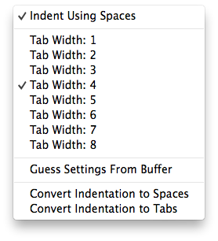
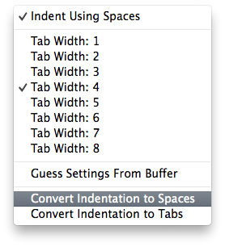

# Code Standards

By now you have seen that PHP has certain rules that must always be followed&mdash;rules about using semicolons, or matching up braces, or putting parenthesis around our function parameters. These rules make up PHP's grammar and syntax, and just like grammar in English, if we do not follow these rules PHP will have trouble understanding what we're trying to say. There are parts of our code that PHP does **not** care about. How far do we indent blocks of code? Do we use tab characters or spaces? Where do we put the curly braces after our function declaration? These are the decisions that make up our coding standards.

Most companies have a set of guidelines about how their code should be styled and organized. These guidelines are intended to help make their code more consistent across all their applications. This consistency is important. By making sure our code follows a uniform set of rules, opening a script that someone else created is less scary. When you and your coworkers agree on how your code should look and be styled, working on a team becomes much easier. Not every organization has a published set of coding standards. Those that don't however, quickly come to regret that.

## The PHP-FIG and PSR

There are dozens of different published frameworks written for PHP, and even more internal frameworks that companies created for their own purposes. In this course we covered one of the most popular new frameworks: Laravel. At some point, several years ago, these frameworks began to interact with each other. One framework would call upon code built in another framework, which in turn would depend some code in a third. Eventually, a group of PHP developers realized they needed to make guidelines so that all their code could interact safely. These developers founded the [PHP Framework Interop Group](http://www.php-fig.org) and published a series of guides to help prevent developers from stepping on each other's toes. These guides are called PHP Standards Recommendation or PSR and outline various best practices that developers of these frameworks should follow. In particular, [PSR-1](http://www.php-fig.org/psr/psr-1/) and [PSR-2](http://www.php-fig.org/psr/psr-2/) provide an excellent set of code standards. Because these standards are broadly supported throughout the PHP community, and because Laravel uses those same standards, we will be following the rules outlined in them.

## Naming Conventions

First and foremost remember, programmers tend to be lazy. The less we have to type the better. More than that, the less keys we have to press at the same time, the better. For this reason most naming conventions start with all variables, functions, and other identifiers being written mostly in lowercase. The complication arrises when developers must name something with two or more words. How do we distinguish between these words without being able to put spaces between them? Overall there are three conventions for how to create multiword variables.

- snake\_case separates each word with an underscore ("_"), so "my first name" becomes `my_first_name`.
  - Examples: `array_pop`, `preg_replace`, `html_entity_decode`, `call_user_func_array`
- camelCase starts each new word with a capital letter, "my first name" becomes `myFirstName`.
  - Examples: `bindValue`, `setFetchMode`, `getElementsByTagName`
- StudlyCaps are like camelCase, but the first letter is also capitalized, in this case "my first name" would be `MyFirstName`.
  - Examples: `PDOStatement`, `HTMLFormElement`, `ReflectionClass`

### Functions and Variables

All functions and variables should be named using camelCase. The opening curly brace for a function goes on the *next* line after the function heading. Let's say we want a function that converts a phone number to a given format, we might write it as follows:

~~~php
/**
 * Function to parse phone number and return a formatted version of that number
 *
 * @param string $phoneNumber Original unformatted phone number
 *
 * @return string Properly formatted phone number
 */
function formatPhone($phoneNumber)
{
    // Do the formatting

    return $formattedPhoneNumber;
}
~~~

Pay attention to the name we used for our function&mdash;`formatPhone`&mdash;and our variables, `$phoneNumber` and `$formattedPhoneNumber`. Also notice the placement of our curly braces. The opening curly brace is on the next line, after our function heading, and is lined up with the 'f' in `function`. The closing curly brace is on its own line as well, after the function body, and lines up with its opening partner.

### Classes and File Names

In most cases, we want classes to appear more prominent than functions or variables. For that reason, we use StudlyCaps to name our classes. Think of them like proper names; class names are like the names of cities, companies, or people. Variables and functions are more like individual items with generic names. For example, maybe I have a `$chair`; where did I get it? `OfficeMax`. Or perhaps a `$console`; what kind is it? `PlayStation`. In this case, `OfficeMax` and `PlayStation` would be classes.

In order to keep our code clean and nicely organized, we will keep all our classes in their own file; one class per file. This helps keep all our classes isolated so that they can be easily managed. This means we need a standard way of naming our files along with our classes. We will be naming our files using StudlyCaps. As a best practice you should always name your file after the class that it describes exactly. For example, if we had a class called `PostsController`, we would save it in a file called `PostsController.php`. An example of this file might look like the following:

~~~php
<?php
/**
 * This file contains my PostsController class
 *
 * @package GithubUsername\ProjectName
 */

require_once('BaseController.php');

/**
 * PostsController
 *
 * Resourceful controller for managing blog posts
 */
class PostsController extends BaseController
{
    /** @var string $someProperty a string property in the class */
    protected $someProperty;

    /**
     * Update a post with a given ID
     *
     * @param int $postId ID of post to update
     *
     * @return GithubUsername\ProjectName\ViewClass
     */
    public function updatePost($postId)
    {
        // Do whatever is needed to update and save the post
    }

    // Other methods our class may need
}

~~~

Again, notice where we put the curly braces: on the line *after* the class heading, just like functions and methods. Also pay attention to the method declarations. All class methods and properties **must** have their visibility declared (`public`, `protected`, or `private`) even if that visibility is technically optional (ie: public).

# Sublime Settings

Sublime can be configured to aide in keeping our files properly formatted. In the bottom right of the Sublime window, next to where the current syntax highlighting is displayed, there is a pop-up menu that will allow you to configure the indentation settings for that file.

When you click this item you should see the following menu; make sure **both** "Indent Using Spaces" and "Tab Width: 4" are checked.

If you find a file you are responsible for does not have the correct indentation, you can fix part of that here by making sure the appropriate options are marked and then selecting "Convert Indentation to Spaces".

If you are uncertain if your settings for a particular file are correct, make sure you see "Spaces: 4" in the bottom left corner, just like in the first picture.
