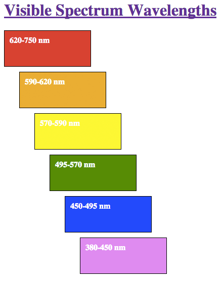

# CSS Box Model and Div/Span

https://vimeo.com/155164200
[CSS Box Model](https://vimeo.com/155164200/21ed42130a)

Every element in an HTML document is represented as a rectangular box. The box model describes a boxes size and how it will interact with other boxes in the document. Several CSS properties come into play when examining the box for a particular element. There are content width and height, padding, border, and margin, and we will be discussing each of these properties in this lesson.

For more information on anything we cover here, look no further than the [Mozilla Developer Network](https://developer.mozilla.org/en-US/docs/Web/CSS/box_model) or [CSS-Tricks](http://css-tricks.com/the-css-box-model/).


## Content Area Width and Height

The content area is the innermost part of the box for a particular element. It is governed by the width and height properties of the element.

### width

> The width CSS property specifies the width of the content area of an element. [More Info](https://developer.mozilla.org/en-US/docs/Web/CSS/width).

```css
element { width: 200px; }
```

### height

> The height CSS property specifies the height of the content area of an element. [More Info](https://developer.mozilla.org/en-US/docs/Web/CSS/height).

```css
element { height: 200px; }
```

## Padding

Padding is the space between the edge of the content area and the border.

> The padding CSS property sets the required padding space on all sides of an element. The padding property is a shorthand to avoid setting each side separately (padding-top, padding-right, padding-bottom, padding-left). [More Info](https://developer.mozilla.org/en-US/docs/Web/CSS/padding).

```css
padding: 10px;              /* on all sides 10px padding */

padding: 10px 20px;         /*  top and bottom 10px padding  */
                            /*  left and right 20px padding  */

padding: 1px 3px 30px 5px;  /*  top    1px  padding  */
                            /*  right  3px  padding  */
                            /*  bottom 30px padding  */
                            /*  left   5px  padding  */
```

## Border

Border is the area between the edge of the padding and the margin.

> The border CSS property is a shorthand property for setting the individual border property values in a single place in the style sheet. border can be used to set the values for one or more of: border-width, border-style, border-color. [More Info](https://developer.mozilla.org/en-US/docs/Web/CSS/border)

```css
element { border: 1px solid black } /* solid, black border of 1px thickness */
```

## Margin

Margin is the area outside of the border. The margin is not used to calculate the overall size of an element but instead affects the other content around the box.

> The margin CSS property sets the margin for all four sides. It is a shorthand to avoid setting each side separately with the other margin properties: margin-top, margin-right, margin-bottom, and margin-left. [More Info](https://developer.mozilla.org/en-US/docs/Web/CSS/margin)

```css
margin: 10px;              /* all sides 10px margin */

margin: 5px 20px;          /* top and bottom 5px, left and right 20px margin */

margin: 10px 3px 30px 5px; /* top 10px, right 3px, bottom 30px, left 5px margin */
```

## Overall Size

The overall size for the box of an element is calculated as follows:

```css
height = height + padding-top + padding-bottom + border-top + border-bottom

width = width + padding-left + padding-right + border-left + border-right
```

## Divs and Spans

When building a web page, sometimes it is helpful to place content in a container without any semantic meaning for the purpose of applying styles. This is where `div` and `span` elements come into play.

### Div

> The HTML `<div>` element (or HTML Document Division Element) is the generic container for flow content, which does not inherently represent anything. It can be used to group elements for styling purposes (using the class or id attributes) or because they share attribute values, such as lang. It should be used only when no other semantic element (such as `<article>` or `<nav>`) is appropriate. [More Info](https://developer.mozilla.org/en-US/docs/Web/HTML/Element/div)

```html
<div>
    <p>Any kind of content here.</p>
</div>
```

### Span

> The HTML `<span>` element is a generic inline container for phrasing content, which does not inherently represent anything. It can be used to group elements for styling purposes (using the class or id attributes) or because they share attribute values, such as lang. It should be used only when no other semantic element is appropriate. `<span>` is very much like a `<div>` element, but `<div>` is a block-level element whereas a `<span>` is an inline element. [More Info](https://developer.mozilla.org/en-US/docs/Web/HTML/Element/span)

```html
<p><span>Some text</span></p>
```

## Exercises

Please follow the instructions below.



1. Create an HTML file named `css_box_model.html` within the `Codeup` folder on your Desktop.
1. Create a CSS file named `box_model.css` within your
   `css` folder.
1. Title the page "Box Model Exercise".
1. Re-create the image shown below as HTML by using the appropriate styling to meet the specifications provided below. Hint: each colored box is a `div` element.



1. Create an HTML file named `css_box_model.html` within the `~/vagrant-lamp/sites/codeup.dev/public` folder on your Mac.
1. Create a CSS file named `box_model.css` within the
   `~/vagrant-lamp/sites/codeup.dev/public/css` folder on your mac.
1. Title the page "Box Model Exercise".
1. Re-create the image shown below as HTML by using the appropriate styling to meet the specifications provided below. Hint: each colored box is a `div` element.





**Specifications:**

- Each colored box has a 1 pixel border.
- The content area of each box is 150 pixels wide by 50 pixels high.
- The overall size of each box is 172 pixels wide by 72 pixels high.
- The orange box is indented by 30 pixels.
- Each subsequent box is indented by 30 more pixels than the previous.
- There are 10 pixels of space between the boxes.
- The wavelength text is bold.
- The header should link to the wikipedia article on the specified subject.

