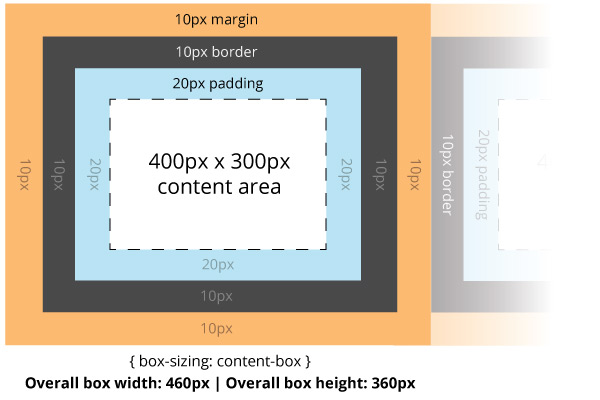
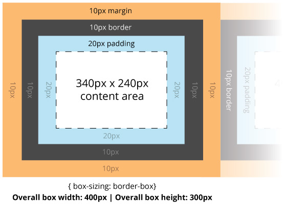

# Box Sizing

> The box-sizing CSS property is used to alter the default CSS box model used to calculate widths and heights of elements. It is possible to use this property to emulate the behavior of browsers that do not correctly support the CSS box model specification. [Mozilla Developers Network](https://developer.mozilla.org/en-US/docs/Web/CSS/box-sizing)

Box-sizing is a way we can alter how the box-model behaves in the browser. By default the box model is set to content-box.

## content-box

```css
box-sizing: content-box;
border: 10px;
height: 300px;
width: 400px;
padding: 20px;
```
As we discussed before the above properties (already default in CSS) is measured by the content inside the box. The height and width set in css will size the content area but the overall box size adds the padding and border to its width and height (i.e. As before the box/content is set to 400px wide then the overall size is the box width + padding left + padding right + border left + border right = 460px width).



## border-box
```css
box-sizing: border-box;
border: 10px;
height: 300px;
width: 400px;
padding: 20px;
```
With the same properties the height and width for the element are in reference to the border. Because this is the property of the box that is the outer part this locks in the dimensions as we would expect the behavior to be. This has been adopted more recently by front end developers for laying out a page.



## How Should We Use It?

```css
html {
    box-sizing: border-box;
}
*, *:before, *:after {
    box-sizing: inherit;
}
```
The following sets the box-sizing: border-box for all HTML elements. Please read the following article supporting this: [Box-sizing: Border-Box FTW](http://www.paulirish.com/2012/box-sizing-border-box-ftw/).

## Exercise

1. Open your `css_box_model.html` file and `box_model.css` file and add the above css to your stylesheet.
1. Now adjust the dimensions of the boxes to meet the specs in the last exercise with the new adjusted border-box settings.
