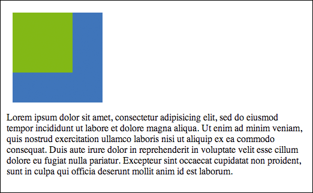
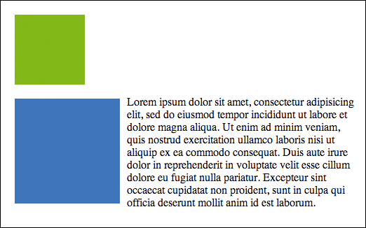
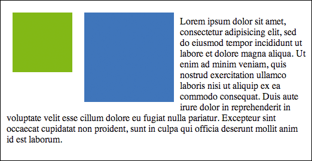
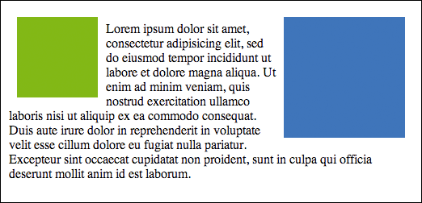
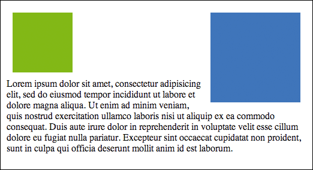
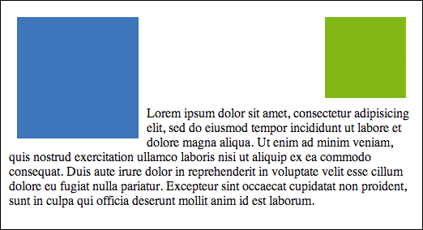
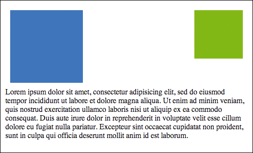
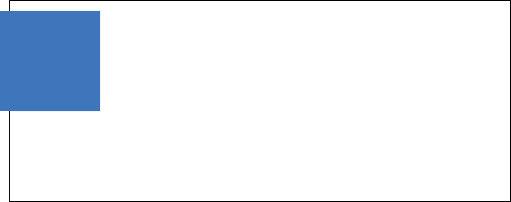
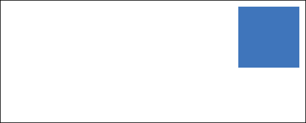
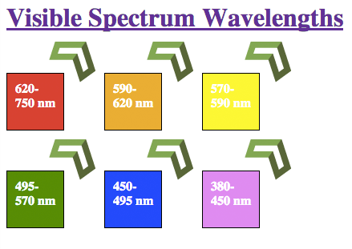

# CSS Floats and Positioning

https://vimeo.com/155164201
[CSS Positioning](https://vimeo.com/155164201/c4906e271e)

In this lesson, we will be discussing several ways to position elements using CSS.

## Floating Elements

CSS `float` provides the ability to have an element break free from the normal document flow and shift to the left or right as far as possible. Once shifted, text and other inline elements can flow around it. The amount an element can float will be determined by the size of the container that it is in and also by other floated elements in the container. Floating elements can be a complex topic, to find out more details look at the [MDN](https://developer.mozilla.org/en-US/docs/Web/CSS/float).

Here is a template we will use throughout our pictorial lesson on floats:

```html
<!DOCTYPE html>
<html>
<head>
<title>Floats Example</title>
    <style>
        #container {
            margin: 50px auto;
            width: 500px;
            border: 1px solid #000;
            padding: 10px;
        }
        #box1 {
            background-color: #77AF00; /* greenish */
            height: 100px;
            width: 100px;
            margin: 10px;
        }
        #box2 {
            background-color: #1969B2; /* blueish */
            height: 150px;
            width: 150px;
            margin: 10px;
        }
    </style>
</head>
<body>
    <div id="container">
        <div id="box1"></div>
        <div id="box2"></div>
        <p>
            Lorem ipsum dolor sit amet, consectetur adipisicing elit, sed do
            eiusmod tempor incididunt ut labore et dolore magna aliqua. Ut
            enim ad minim veniam, quis nostrud exercitation ullamco laboris
            nisi ut aliquip ex ea commodo consequat. Duis aute irure dolor
            in reprehenderit in voluptate velit esse cillum dolore eu fugiat
            nulla pariatur. Excepteur sint occaecat cupidatat non proident,
            sunt in culpa qui officia deserunt mollit anim id est laborum.
        </p>
    </div>
</body>
</html>
```

### Template as-is with No Floats


As you can see, without any `float` applied all the elements on the page stack because of the nature of block elements.

### Box 1 Float Left



Here, `float:left` has been applied to `box1`. This causes `box1` to break free from the normal page flow and move to the left to the edge of its parent container. Also notice that the other page content has moved up since `box1` is no longer part of the normal page flow.

### Box 2 Float Left



Here, `float:left` has been applied to `box2`. Now we can see that the paragraph content has moved up and is being pushed to the side by `box2`. Also notice that `box1` is still on its own line since there is no float applied to it now.

### Box 1 and Box 2 Float Left



Here, `float:left` has been applied to `box1` and `box2`. Notice that `box1` has moved to the left of its container, however, `box2` only moved to the edge of `box1`. If another box were floated, it would come to the edge of `box2`, unless there wasn't enough space, and then it move down to the next line and over to the left. You can again see how the paragraph has moved up and is wrapping around the floated elements.

### Box 1 Float Left and Box 2 Float Right



Here, `float:left` has been applied to `box1` and `float:right` has been applied to `box2`. Notice that `box1` has moved to the left of its container, however, `box2` only moved to the edge of `box1`. If another box were floated, it would come to the edge of `box2`, unless there wasn't enough space, and then it move down to the next line and over to the left.

### Box 1 Float Left and Box 2 Float Right, Paragraph Clear Left



Here, `float:left` has been applied to `box1` and `float:right` has been applied to `box2` again. The difference is that we are introducing a new property called `clear`. The `clear` property allows us to have content "clear" or move below elements that are floated to either the `left`, `right`, or `both` (either left or right). In this example, `clear:left` has been applied to the `p` element. As a result, the paragraph has moved below `box1`, but still wraps around the right floated `box2`. Like floats, `clear` can be a surprising property, please reference the [MDN](https://developer.mozilla.org/en-US/docs/Web/CSS/clear) for more information.

### Box 1 Float Right and Box 2 Float Left, Paragraph Clear Right



Here, we have swapped the floats on the boxes so that `float:left` has been applied to `box2` and `float:right` has been applied to `box1`. We also changed the clear property on the `p` element to `clear:right`.

### Box 1 Float Right and Box 2 Float Left, Paragraph Clear Both



This example has the same floats applied as the previous, however the `p` element now has `clear:both`. You can see that this causes the paragraph to move below both `box1` and `box2`.

## Positioning Elements

The default positioning for elements is referred to as `static`. This just means that the element will be rendered in order with the normal flow of the document. When elements that have a `position` property set to something other than `static`, there are a few other properties that become applicable. These properties are top, left, bottom, and right.

### Top / Left / Bottom / Right

The top, left, bottom, and right properties can be assigned pixel values to describe how far away from the corresponding position the box for the target element will be displayed. These properties will have not impact on an element with the default `position:static`, but we will be using them in the sections below.

### Relative Positioning

By assigning the property value `position:relative` to an element, you enable the top/left/bottom/right properties. When used with a relatively positioned element, these properties will shift the element from its normal position by the amount specified. Let's see an example:

```html
<!DOCTYPE html>
<html>
<head>
<title>Relative Positioning</title>
    <style>
        #container {
            margin: 50px auto;
            width: 500px;
            height: 200px;
            border: 1px solid #000;
        }
        .box {
            background-color: #1969B2;
            height: 100px;
            width: 100px;
            position: relative;
            top: 10px;
            right: 10px;
        }
    </style>
</head>
<body>
    <div id="container">
        <div class="box"></div>
    </div>
</body>
</html>
```

In the example above, we have a 500x200px container div with a relatively positioned 100x100px div (box). The box has properties `top:10px` and `right:10px`. These will cause the box to shift down by 10px and to the left by 10px as seen in the image below.



### Absolute Positioning

Another type of positioning is `absolute`. Once again, by assigning the property value `position:absolute` to an element, you enable the top/left/bottom/right properties, however, the properties work differently in this case.

If an absolutely positioned element is in a relatively positioned container, the top/left/bottom/right property values will be relative to the relatively positioned container. If the absolutely positioned element is not in a relatively positioned container, the top/left/bottom/right property values will have no effect.

```html
<!DOCTYPE html>
<html>
<head>
    <title>Absolute Positioning</title>
    <style>
    #container {
        margin: 50px auto;
        width: 500px;
        height: 200px;
        border: 1px solid #000;
        position: relative;
    }
    .box {
        background-color: #1969B2;
        height: 100px;
        width: 100px;
        position: absolute;
        top: 10px;
        right: 10px;
    }
    </style>
</head>
<body>
    <div id="container">
        <div class="box"></div>
    </div>
</body>
</html>
```

Most of the code from the previous example was reused here. Note that the container now has `position:relative` and the box has `position:absolute`. The `top:10px` and `right:10px` now place the box 10px away from the top right corner of the container as seen in the image below.



### Fixed Positioning

One more type of positioning to discuss is `fixed` positioning. Have you ever seen page elements that do not move even when the page is scrolled? These elements have `position:fixed` applied, which causes them to be positioned relative to the browser window.

```html
<!DOCTYPE html>
<html>
<head>
    <title>Fixed Positioning</title>
    <style>
        #container {
            margin: 50px auto;
            width: 500px;
            height: 2000px;
            border: 1px solid #000;
        }
        .box {
            background-color: #1969B2;
            height: 100px;
            width: 100px;
            position: fixed;
            top: 10px;
            right: 10px;
        }
    </style>
</head>
<body>
<div id="container">
    <div class="box"></div>
</div>
</body>
</html>
```

Again, much of the example code is the same. The `position` property has been removed from the container and the box now has `position:fixed`. The `top:10px` and `right:10px` now place the box 10px away from the top right corner of the browser. The container height has also been increased to allow for scrolling and to show that the box do not move even when the page is scrolled.

## Exercises

Please follow the instructions below.



1. Create an HTML file named `css_positioning.html` within the `Codeup` folder on your Desktop.
1. Copy the contents of the `css_box_model.html` lesson to the file you just created to use as the starting point.
1. Title the page "Positioning Exercise".
1. Re-create the image shown below as HTML by using the appropriate styling to meet the specifications provided below.
1. Add the Codeup Ribbon image (download image below) to the upper right corner of your page.



1. Create an HTML file named `css_positioning.html` within the `~/vagrant-lamp/sites/codeup.dev/public` folder on your Mac.
1. Copy the contents of the `css_box_model.html` lesson to the file you just created to use as the starting point.
1. Title the page "Positioning Exercise".
1. Re-create the image shown below as HTML by using the appropriate styling to meet the specifications provided below.
1. Add the Codeup Ribbon image (download image below) to the upper right corner of your page.





### Specifications:

- No line breaks or paragraphs should be used. Use positioning, floats, and clears as appropriate.
- Each colored box as a 1 pixel border.
- The content area of each box is 50 pixels wide by 50 pixels high.
- The overall size of each box is 72 pixels wide by 72 pixels high.
- There is 50 pixels of space between the header and the boxes.
- There is 50 pixels of space between the boxes themselves.
- The Codeup arrow has been added to each box (download image below).


### Bonus

1. There are several different ways to move the fourth box to the second line. Research the `:nth-child` pseudo class and use that to position the second row of boxes.
2. Rearrange the boxes so that they are in three rows of two. Your HTML should stay the same, and there should only be a small change to your stylesheet.
