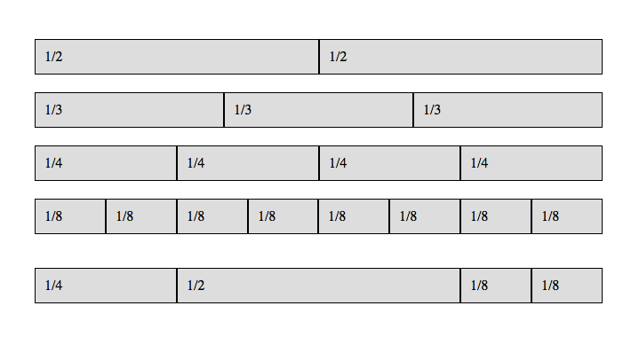

# Grids

A lot of developers use grids or frameworks to simplify or speed up their development (not the same as why a designer might use a grid). Unfortunately, many developers end up relying on these frameworks so much, that they cannot build a website without them. This lesson is intended to give you a breakdown on how grids are built so that you can edit them without any worry and become a much more versatile front-end developer.

> It has the same basic rules, rules like gravity. What you must learn is that these rules are no different that the rules of a computer system. Some of them can be bent. Others can be broken.
> <footer><cite>[Morpheus](http://www.imdb.com/title/tt0133093/)

Grids are a great way to separate layout from other presentational styling. Using a combination of HTML and CSS, they are built with the idea that there are main *containers* that contain *rows* and rows contain *columns*. Usually grids are designed to have 12 columns, though its all up to you how you prefer to build it.

## Containers

A container will first wrap rows. Usually a container will have a predefined width that everything will fit into. Some grids are built to extend edge to edge of the browser by using 100% for their width. For this example, we are going to use 1200px as a max width for our container and center it.

```html
<!-- HTML -->
<div class="container">
    <!-- ... -->
</div>
```

```css
/* CSS */
.container {
    margin: 0 auto;
    width: 80%;
    max-width: 1200px;
}
```

## Rows

Rows are what we use to hold our columns and span the entire width of the container. Rows are used to horizontally separate one group of columns from another.

```html
<!-- HTML -->
<div class="row">
    <!-- ... -->
</div>
```

```css
.row {
    width:100%;
}

.row:after {
    content: "";
    display: table;
    clear: both;
}
```

## Columns

Columns stand vertically within a row, as you would expect. You would need to determine how many columns you need and adjust accordingly. Keep in mind, the class names in these examples are ONLY examples. Every grid built, whether by you or another, determine their own naming conventions.

```html
<div class="row">
    <div class="column one-half">1/2</div>
    <div class="column one-half">1/2</div>
</div><!-- /.row -->
<div class="row">
    <div class="column one-third">1/3</div>
    <div class="column one-third">1/3</div>
    <div class="column one-third">1/3</div>
</div><!-- /.row -->
```

```css
.column {
    float: left;
    padding: 10px;
}
.column.one-third {
    width: 33.33%;
}
.column.one-half {
    width: 50%;
}
```

## Exercise

1. After each step commit your changes to git. Push your commits to GitHub at the end of the exercise.
1. Make sure your page uses `border-box` sizing.
1. Build your own grid layout using the examples above.
1. Create column class for `one-half`, `one-third`, `one-fourth`, `one-sixth` and `one-eighth`.
1. Add borders and background colors to your column classes so that you can see the difference between each class.
1. Have at least one row that includes three different column classes

You should wind up with a page that looks similar to the following:



### Bonus

1. Create additional rules so that we have a wider variety of widths and fractions available. Be sure to minimize the number of additional rules you create. For example, we could create a divs with the following classes:
    ```html
    <div class="column two-third"></div>
    <div class="column three-eighth"></div>
    <div class="column two-fourth"></div>
    <div class="column three-sixth"></div>
    ```
    _**Hint:** The last two `<div>`s in the example above have the same width as an existing rule._
1. Many grid systems provide a way for columns to skip over spaces. Using `margin`s, add additional classes called `offset-one-half`, `offset-one-third`, `offset-two-third`, `offset-one-fourth`, etc force a column to move over that specified space.
