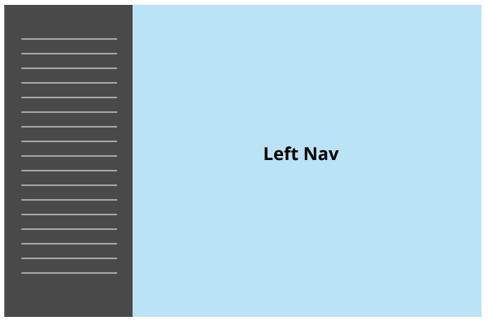
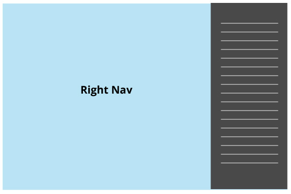
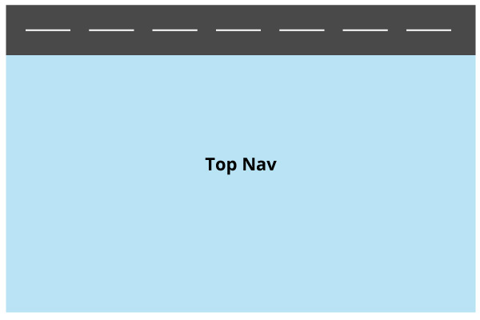

# Layouts

Throughout the history of the web, developers have often tried to accomplish meaningful, familiar, or stylistic layouts. As time went on and front-end development advanced, we have been able to achieve these layout choices.

## Left sidebar/nav
A left sidebar layout is setup with navigation set to the left side of the design and the content sits on the right. Typical sidebars are used for navigation items but can also be used for secondary content. See image below.

## Right sidebar/nav
A right sidebar layout is setup with navigation or sidebar to the right and content on the left. See image below.

Often a right sidebar is useful for supplemental or secondary information, rather than primary navigation.

## Top Navbar

Top nav is setup with the navigation on top for every page.

## Combination

Sometimes a layout may have a combination of two or more of the above. Sometimes a design/layout may call for a top nav with left and right nav bars and content in the middle. Think of something like facebook where you have a top nav, left sidebar, middle content and right sidebar.

## Exercise
1. Create two files one named `codeup.dev/public/layouts.html` and another named `codeup.dev/public/css/layout.css`.
1. Combine top navbar with left sidebar layout so that the top nav sits above the left sidebar and right content area.
1. Now add a footer below the left sidebar and content area
1. Make that sidebar an `<aside>` element and add a `<ul>` with `<li>`s containing links to 3 popular websites
1. Place an image of the Death Star within the content area, float it left.
1. Find content online about the Death Star. Copy it and add it to your content area after the image using proper elements.
1. Style the `<body>` so that it has a gray background of `#e1e1e1`
1. Style the `<aside>` so that it has a white background, `20px` padding all the way around and at least a `20px` margin between it and the main content area
1. For fun, round all the corners of the `<aside>` by `3px`
1. Add some copyright text in the footer
1. Add some fake links in the footer using a `<ul>` with `<li>`s but force them to be display in a line and not stacked

__Bonus__

1. Now create another file called `codeup.dev/public/layouts-right.html` you may use the same css file if you choose. Now create the same page but the sidebar on the right hand side.
1. Now create another file called `codeup.dev/public/layouts-combination.html` and you may use the same css file if you choose. Now create the same page that has top nav, left nav and right nav. The right nav should be `<aside>` and have a `<ul>` with `<li>`'s inside of it. Link this to pages about the new Star Wars move that is coming out.
