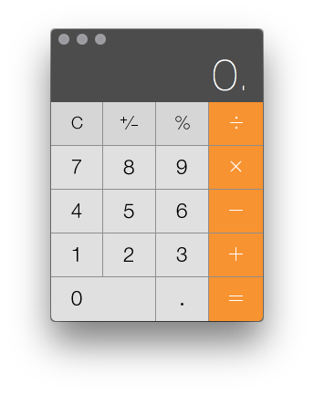
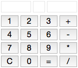
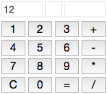
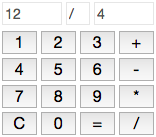
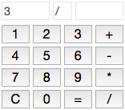

# JavaScript Calculator

Clearly, computers are very good at solving complex mathematical questions very quickly. It is right in the name even! And your computer came with a pretty nifty little calculator built in.

But you are a programmer now, you do not just use other people's applications, you build them yourself. If you were to build a calculator using JavaScript and HTML, it might look something like this:

This calculator uses HTML buttons for its inputs, and three text input fields for handling its data. When a user presses the number keys, their value is inserted into the first input ("left operand").

Once a user presses a operator button (`+`, `-`, `*`, or `/`) it gets put into the middle input.

After an operator is selected, numbers are now entered into the last input ("right operand").

Finally, the user presses `=`, and the calculation is performed with the result being inserted into the first input again. The operator is maintained so that the user can quickly repeat the operation with following operand(s).

Pressing `C` brings everything back to the initial state.

## Exercise

You will build a JavaScript calculator similar to the example shown above. You can lay it out and design it however you like, but putting your data in three separate input fields (left operand, operator, right operand) will be essential. Use one or more `click` event listeners on the buttons to interact with your application. You can add `readonly` to your input fields to ensure the user does not accidentally type into them.

### Bonus!

- Looks like we left the decimal point (`.`) button off our example. [D'oh](https://www.youtube.com/watch?v=5JamMWk9D68)! You should fix that for us.
- Use all the nifty CSS and HTML we have covered to really add some shine to your calculator. You might want to use anchor tags (`<a>`) instead of buttons to give yourself some more flexibility in terms of styling.
- There are a few functions the Apple Calculator does that ours does not, including converting number to negative and percentages. In addition, there are dozens more you could add such as square roots, exponents, trigonometry, etc.
- Convert the calculator to use [Reverse Polish Notation](http://www-stone.ch.cam.ac.uk/documentation/rrf/rpn.html). You may be surprised to discover this solution will take significantly less code and logic than our original solution! (For example, you would no longer need three separate input fields, just a simple `textarea` would work well.)
- Add the ability to convert and calculate values in binary and/or hexadecimal (hint: [`parseInt()`](https://developer.mozilla.org/en-US/docs/Web/JavaScript/Reference/Global_Objects/parseInt) can actually do a lot of this for you).
