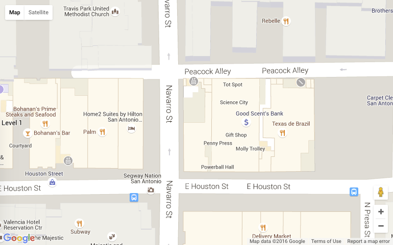
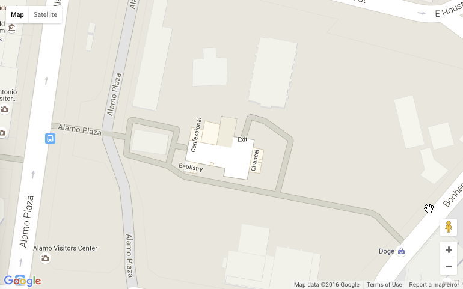
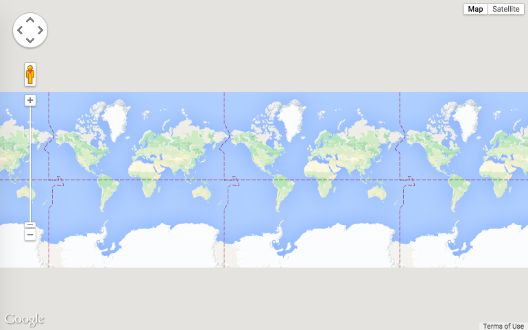
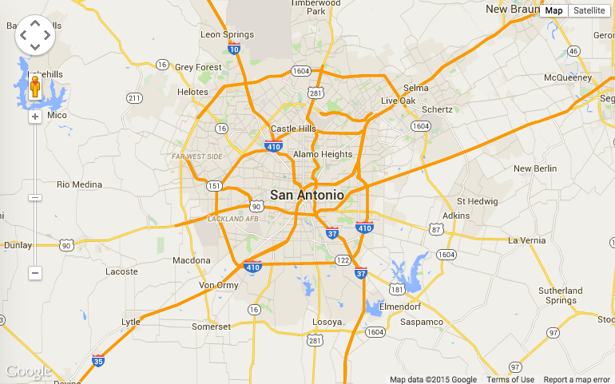
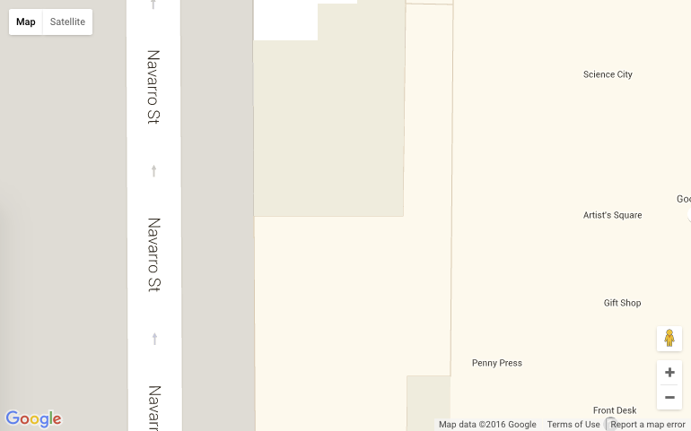
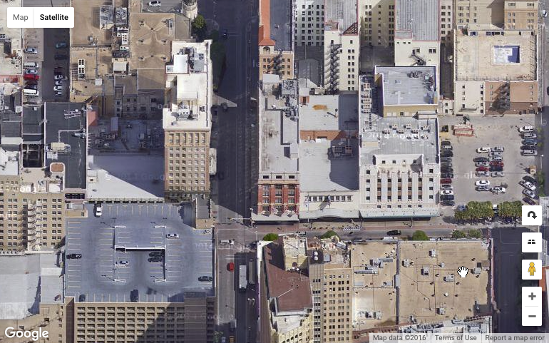
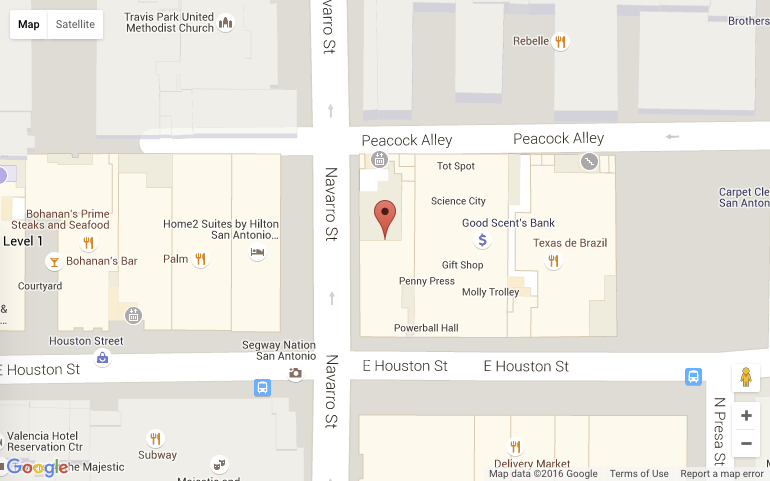
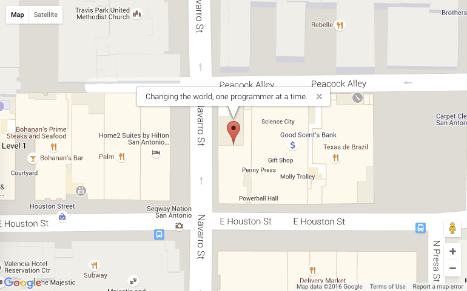

# Google Maps API

Adding maps to our applications can give users a lot of information in a visual format. Maps can display locations, directions, search results, and a wide variety of data in a way that is easily consumed by our users.

Thanks to Google Maps, we can use their *application program interface* (API) to dynamically create and manipulate real world maps.

## The JavaScript API

Google offers a robust JavaScript API for generating and customizing maps. The current version of their API (v3) allows for many features including generating directions, finding locations based on name or address, geocoding, street views, overlays, and many other amazing capabilities. We can find out more about these features by reading their [online documentation](https://developers.google.com/maps/documentation/javascript/)

We will be covering several areas of the API in this lesson. Many other web services offer APIs with similar ease of use. Integrating existing technologies into our applications can provide users with a very rich experience.

### Generating an API Key

To interact with the Google Maps API, we will need to have a key for our application to use. This key will allow us to make up to 25,000 requests per day. For more information consult [the documentation](https://developers.google.com/maps/documentation/javascript/usage). If an application is launched to the public using the API, we might need to purchase a plan that allowed for more requests.

[Follow the instructions](https://developers.google.com/maps/documentation/javascript/tutorial#api_key) to generate and copy your API key for Google Maps.

## Generating Maps

Once we have an API key, it is time to make some maps.

### Using Lat and Long

The JavaScript API uses latitude and longitude for map coordinates. To generate a map using lat and long and the JavaScript API we could use some code like this:

~~~html
<!DOCTYPE html>
<html>
<head>
    
</head>
<body>
    <!-- div to hold map -->
    

    <!-- Load the Google Maps API [DON'T FORGET TO USE A KEY] -->
    

    <!-- Script to show address on map -->
    
</body>
~~~

In this page we are creating a `
` with an id of `map-canvas` to hold our map. In our CSS we have set the `height` and `width` of our `
`.

Next we see this line:

~~~html
<!-- Load the Google Maps API [DON'T FORGET TO USE A KEY] -->

~~~

This simply loads the Google Maps API JavaScript library for our use.

Next, we configure the settings our map options object. The docs say this about the `mapOptions` object:

> To initialize a Map, we first create a Map options object to contain map initialization variables. This object is not constructed; instead it is created as an object literal. There are two required options for every map: center and zoom.

We will create a simple `mapOptions` object literal with the `zoom` and `center` variables as required.

~~~js
var mapOptions = {
    // Set the zoom level
    zoom: 18,

    // This sets the center of the map at our location
    center: {
        lat:  29.426791,
        lng: -98.489602
    }
};
~~~

We will cover `zoom` in a bit, for now we should concentrate on the `center` property that we are setting. Here we are passing an object literal with the predefined keys of `lat` and `lng` to represent *latitude* and *longitude*, respectively.

Lastly, we need to generate the map in our `
`.

~~~js
// Render the map
var map = new google.maps.Map(document.getElementById("map-canvas"), mapOptions);
~~~

Here we are passing the element with an `id` of `map-canvas`, in our case a `div`.

This should draw our map:

### Geocoding

To use more common inputs for locations, such as *addresses, cities, states, or zip codes*, we must first geocode our location and get lat and long values for the Maps API.

The API provides a geocoding service, and we can use it to generate the value we need.

To learn more about the Google Maps API geocoding service, [visit the documentation](https://developers.google.com/maps/documentation/javascript/geocoding).

Before we begin getting locations back for things like an address, we must first get a new instance of the `Geocoder()` object.

~~~js
var geocoder = new google.maps.Geocoder();
~~~

The `Geocoder` object has a method `.geocode`.

~~~js
geocode(request:GeocoderRequest, callback:function(Array.<GeocoderResult>, GeocoderStatus))
~~~

We will be adding our address to the request, and then putting a function in the callback to handle the response.

~~~js
// Include code from previous example

// Set our address to geocode
var address = "300 Alamo Plaza, San Antonio, TX, 78205";

// Init geocoder object
var geocoder = new google.maps.Geocoder();

// Geocode our address
geocoder.geocode({ "address": address }, function(results, status) {

   // Check for a successful result
   if (status == google.maps.GeocoderStatus.OK) {

       // Recenter the map over the address
       map.setCenter(results[0].geometry.location);
   } else {

       // Show an error message with the status if our request fails
       alert("Geocoding was not successful - STATUS: " + status);
   }
});
~~~

We start off by defining an address to geocode, and creating a new instance of the Geocoder object.

In the `geocode` method we pass an object literal setting the `address` key to the `address` variable we created as the first parameter. In the second argument, we use an anonymous function to handle the callback.

In the callback, we first check to make sure the result did not contain any errors by using `status == google.maps.GeocoderStatus.OK`. If the result does not have errors, we are using the results array that is returned to set the `center` of our map using `setCenter()`.

When we refresh the page, we should see the map get re-centered above a certain famous landmark.

## Custom Map Features

The Google Maps API offers many features, more than we can cover here. In this section we will cover the more commonly used features, and this should give us a solid foundation to explore the documentation in more detail, and allow us to have more customization in our final maps.

### Zoom Levels

Being able to set the amount of map tiles in a given area, or *zoom*, is a great feature when different levels of detail are required.

The docs give us a good definition of zoom levels in the API:

> The initial resolution at which to display the map is set by the zoom property, where zoom 0 corresponds to a map of the Earth fully zoomed out, and higher zoom levels zoom in at a higher resolution.

If we adjust our map's zoom to `0` we can see it is indeed the entire Earth, and then some.

At `10` we can see the city and surrounding area.

And at `21` we get an **intense closeup** of the Vogue Building.

_**Note:** The maximum zoom varies from region to region. In San Antonio it is `21`, in other places it can be as detailed as `23`._

### Map Types

There are 4 [map types](https://developers.google.com/maps/documentation/javascript/maptypes#BasicMapTypes) available in the API

- `MapTypeId.ROADMAP` &mdash; default road map view. This is the default map type.
- `MapTypeId.SATELLITE` &mdash; Google Earth satellite images
- `MapTypeId.HYBRID` &mdash; mixture of roadmap and satellite views
- `MapTypeId.TERRAIN` &mdash; physical map based on terrain information.

According to the documentation:

> You modify the map type in use by the Map by setting its `mapTypeId` property, either within the constructor via setting its Map options object, or by calling the map's `setMapTypeId()` method. The `mapTypeID` property defaults to `MapTypeId.ROADMAP`.

In our constructor we could set the map type as follows:

~~~js
'use strict';

var mapOptions = {
    // Set the zoom level
    zoom: 19,

    // This sets the center of the map at our location
    center: {
        lat:  29.426791,
        lng: -98.489602
    },

    // Show this map in satellite view
    mapTypeId: google.maps.MapTypeId.SATELLITE
}

// Render the map
var map = new google.maps.Map(document.getElementById("map-canvas"), mapOptions);
~~~

We could also set the type on an existing map object:

~~~js
map.setMapTypeId(google.maps.MapTypeId.SATELLITE);
~~~

Either of these will make our map show a satellite image of our selected area.

## Markers

Markers, sometimes referred to as pins, are used to show specific locations on a map. We can use these to identify locations for our users.

To create a marker on a map, we simply pass a position and a map to the `google.maps.Marker` constructor as described in [the documentation](https://developers.google.com/maps/documentation/javascript/markers).

Assuming we had a `map` variable like before, we could place a marker on it with the following:

~~~js
// Create lat and long for our marker position
var codeup = { lat: 29.426791, lng: -98.489602 };

// Add the marker to our existing map
var marker = new google.maps.Marker({
    position: codeup,
    map: map
});
~~~

Now we can see a marker on our map.

### Info Windows

According to [the documentation](https://developers.google.com/maps/documentation/javascript/infowindows):

> An InfoWindow displays content (usually text or images) in a popup window above the map, at a given location. The info window has a content area and a tapered stem. The tip of the stem is attached to a specified location on the map. Typically you will attach an info window to a marker...

We can attach an info window to our marker with a few additional lines:

~~~js
// Create a new infoWindow object with content
var infowindow = new google.maps.InfoWindow({
    content: "Changing the world, one programmer at a time."
});

// Open the window using our map and marker
infowindow.open(map, marker);
~~~

Our map with marker and info window:

## Exercises

Please follow the instructions below. Remember to commit your changes after each step. At the end of the exercise push your changes to GitHub.

1. Generate a Google Maps API Key using [these instructions](https://developers.google.com/maps/documentation/javascript/tutorial#api_key)
1. Create a new file name `google_maps_api.html` and add the following map.
1. Generate a map that shows the city with your favorite restaurant using geocoding.
1. Redraw the map of the above location at zoom levels 5, 15, and 20.
1. Create a marker on your map of the exact location of your favorite restaurant and adjust the zoom to allow for best viewing distance.
1. Create an info window with the name of the restaurant.
1. Zoom in and verify that you have identified the correct location. Double check it against [Google Maps](http://maps.google.com)

### Bonuses:

- Info windows can contain basic HTML, not just plain text. Add some addition information about your restaurant to the info window such as why it is your favorite, dishes you like, etc.
- Research Google Maps Events. Make sure the info window does not display until the marker has been clicked on.
- Add a *drop* animation to the marker when the page first loads.
- Refactor your code to display at least three favorite restaurants with information about each. You should create an array of JSON objects with information about each restaurant to accomplish this. You will most likely need to use a `.forEach()` loop rather than a `for`.
- Replace the generic marker icon with an image that is more appropriate for each restaurant.
