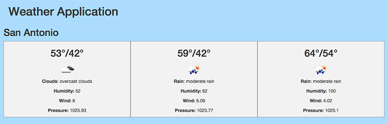
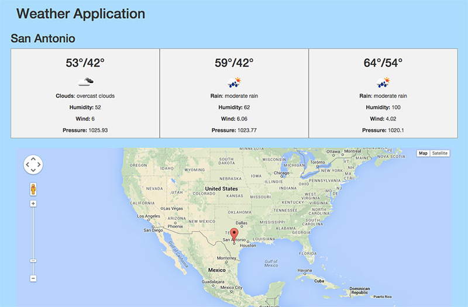

# What is an API

API stands for _application programming interface_. An API is any way for one application or program to communicate with another one. There are tens of thousands of APIs in the world, many of which are actually built into our programming languages and tools. For example, later in this course you will be writing PHP code that communicates with a MySQL database. The way PHP does this is through an API provided by MySQL.

When we talk about APIs in JavaScript, typically we are talking about services that can send or retrieve data over the internet using ajax. Again, there are [thousands](http://www.publicapis.com), upon [thousands](http://catalog.data.gov/dataset?sort=views_recent+desc&res_format=api), upon [**thousands**](http://www.programmableweb.com/category/all/apis?data_format=21175%2C21173%2C21190) of open APIs you can use with JavaScript. Most of these use [*REpresentational State Transfer (REST)*](http://en.wikipedia.org/wiki/Representational_state_transfer#Architectural_constraints) for communication. Later in this course you will learn how to make your own RESTful API using Laravel, but communicating with another company's API will give us a good preview of how the process works.

## OpenWeatherMap API

In this section we will work with an API from [OpenWeatherMap](http://openweathermap.org). This API offers a variety of information for free, including [current weather data](http://openweathermap.org/current), [forecast information](http://openweathermap.org/forecast), and can even be used to upload data from your own [weather station](http://openweathermap.org/stations).

The first thing to do is to [sign up](http://openweathermap.org/register) with OpenWeatherMap. Once you register, you will be given an [APPID](http://openweathermap.org/my) such as `467fce2fbe4d967cacd8c8886374905a`. This ID is how we will identify ourselves to the API when we make our requests.

_**Note:** Most APIs will require the use of an App ID or API Key such as this, and will return an error if it is omitted or an invalid key is sent. OpenWeatherMap is unique in that it...does not. Even though OpenWeatherMap will respond with correct data without providing an APPID, it is still good practice to include it, in case their requirements change or rate limits start being enforced._

## Pulling San Antonio Weather

We can query for San Antonio weather data by sending an ajax `GET` request and including `q: San Antonio, TX` like the following:

```js
$.get("http://api.openweathermap.org/data/2.5/weather", {
    APPID: "467fce2fbe4d967cacd8c8886374905a",
    q:     "San Antonio, TX"
});
```

Remember, there are a lot of different ways we can format this request. All of the following ajax calls are identical to the one above.

```js
$.ajax({
    url: "http://api.openweathermap.org/data/2.5/weather",
    type: "GET",
    data: {
        APPID: "467fce2fbe4d967cacd8c8886374905a",
        q:     "San Antonio, TX"
    }
});

$.ajax("http://api.openweathermap.org/data/2.5/weather", {
    data: {
        APPID: "467fce2fbe4d967cacd8c8886374905a",
        q:     "San Antonio, TX"
    }
});

$.get("http://api.openweathermap.org/data/2.5/weather?APPID=467fce2fbe4d967cacd8c8886374905a&q=San+Antonio,+TX");
```

When you start exploring a new API, it is important to learn what data is sent back from each request. We can exploring this information using `console.log()` inside of a `.done()` handler:

```js
$.get("http://api.openweathermap.org/data/2.5/weather", {
    APPID: "467fce2fbe4d967cacd8c8886374905a",
    q:     "San Antonio, TX"
}).done(function(data) {
    console.log(data);
});
```

When we log the data, we will see it is a JSON object like the following:

```json
{
    "coord": {
        "lon": -98.49,
        "lat": 29.42
    },
    "sys": {
        "type": 3,
        "id": 60540,
        "message": 0.008,
        "country": "United States of America",
        "sunrise": 1425473734,
        "sunset": 1425515734
    },
    "weather": [{
        "id": 804,
        "main": "Clouds",
        "description": "overcast clouds",
        "icon": "04n"
    }],
    "base": "cmc stations",
    "main": {
        "temp": 287.55,
        "humidity": 95,
        "pressure": 1013.102,
        "temp_min": 287.55,
        "temp_max": 287.55
    },
    "wind": {
        "speed": 2.12,
        "deg": 178.5
    },
    "rain": {
        "3h": 0
    },
    "clouds": {
        "all": 92
    },
    "dt": 1425430669,
    "id": 4726206,
    "name": "San Antonio",
    "cod": 200
}
```
Much of this information seems relatively obvious, such as `lat`, `lon`, `country`, etc. Some of the other pieces are less clear. If any part of an API request is confusing, remember to always go back to the [documentation](http://openweathermap.org/weather-data#current). Notice that the temperature is expressed in [Kelvin](http://en.wikipedia.org/wiki/Kelvin). We can change that by passing yet another [parameter](http://openweathermap.org/current#other) to the request.

```js
$.get("http://api.openweathermap.org/data/2.5/weather", {
    APPID: "467fce2fbe4d967cacd8c8886374905a",
    q:     "San Antonio, TX",
    units: "imperial"
}).done(function(data) {
    console.log(data);
});
```

Our temperature should now be coming back in degrees fahrenheit. Let's look at other ways we can request this information. In particular, from the data we can see that San Antonio has an `id` of "4726206". We can use that to look up weather information as well:

```js
$.get("http://api.openweathermap.org/data/2.5/weather", {
    APPID: "467fce2fbe4d967cacd8c8886374905a",
    id:     4726206,
    units: "imperial"
}).done(function(data) {
    console.log(data);
});
```

We will get the same information back as before. We can also look information by its latitude and longitude:

```js
$.get("http://api.openweathermap.org/data/2.5/weather", {
    APPID: "467fce2fbe4d967cacd8c8886374905a",
    lat:    29.423017,
    lon:   -98.48527,
    units: "imperial"
}).done(function(data) {
    console.log(data);
});
```

Latitude and longitude have the advantage that we can look up weather information for any place on earth, even if we do not know its name or id. Finally, let's look at how we could get [*forecast* information](http://openweathermap.org/forecast) using those same coordinates:

```js
$.get("http://api.openweathermap.org/data/2.5/forecast/daily", {
    APPID: "467fce2fbe4d967cacd8c8886374905a",
    lat:    29.423017,
    lon:   -98.48527,
    units: "imperial"
}).done(function(data) {
    console.log(data);
});
```

This time we have changed what URL we are sending our request to. The URL you send API requests to is often called its *endpoint*. We have separate endpoints for each type of API request we can send.

Like we did when we first started exploring the current weather conditions, be sure to take a look at the data our request [returns](http://openweathermap.org/weather-data#16days).

## Exercise

1. In `~/vagrant-lamp/codeup.dev/public` create a new html file called `weather_map.html`.
1. Using HTML, CSS, jQuery, ajax, and the OpenWeatherMap API, start by showing the current conditions for San Antonio on your page.
1. Update your layout and ajax request(s) to display a three day forecast for San Antonio that looks like the screenshot below.

   

   _**Hint:** The URLs for OpenWeatherMap's icons are formatted `http://openweathermap.org/img/w/[icon].png` where `[icon]` comes from the API request._
1. Create input boxes for "Latitude" and "Longitude" and a `<button>` that will take the values from those inputs and feed them into your API request. Use Google Maps to [find the coordinates](https://support.google.com/maps/answer/18539) for different places around the world and test this out.
1. Go back to your Google Maps API exercise. Recreate the map below your 3 day forecast. Read through the documentation for the Google Maps API and figure out how to allow the user to drop a pin on any place on the map. Once the user drops a pin, grab its coordinates and feed those into your OpenWeatherMap API. Update the three day forecast with the information from those coordinates (you should also get rid of your input boxes at this point).

   
1. As you complete each step, commit your changes and push them to GitHub.
