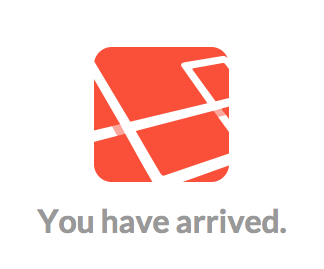

# Introduction and Installation

Laravel is an MVC (see below) framework that makes it easy to build dynamic web applications. The syntax is expressive and easy to remember and it aims to make coding a fun and enjoyable experience. We will be using Laravel to build a complete blog application from scratch. Along the way you will learn about many of the outstanding tools that are built into the Laravel framework.

The [Laravel documentation](http://laravel.com/docs/4.2) is well organized and easy to read, and we will be referring to it many times throughout this unit.

Code Bright, a book about Laravel, is another great resource. You can read it online [here](http://daylerees.com/codebright).

## What is MVC?

MVC stands for Model-View-Controller. MVC is a software pattern that separates data, programming logic, and presentation into separate parts to allow for a more organized and more easily maintained codebase.

- *Models* represent the data layer of the application.
- *Views* represent the presentation layer of the application.
- *Controllers* provide the glue that link the Models and Views together.

As we move forward with the blog application you will see exactly how all the pieces work together.

## System Requirements

The Laravel framework has a few system requirements:

- PHP >= 5.3.7
- MCrypt PHP Extension

Fortunately, our VM is already set up to meet these requirements.

## Installation

Laravel can be installed in several different ways. We will be using Composer, a dependency management tool for PHP, to install Laravel. Composer has already been installed in the Virtual Machine you are using for class. By utilizing Composer we can automatically download and install Laravel and all of its dependencies.

Detailed information about Composer can be found on their [website](https://getcomposer.org/).

### Run Composer

In order to create a new Laravel project, you first need to ssh into your VM. As always,

```bash
cd ~/vagrant-lamp/
vagrant ssh
```

Once inside your VM, run the following commands:

```bash
cd /vagrant/sites
composer create-project laravel/laravel blog.dev 4.2.* --prefer-dist
```

_**Note:** If you are prompted to authenticate in this process, enter your GitHub username and password._

The above commands tell Composer to create a new Laravel project in a folder named `blog.dev` using version `4.2`.

You may receive a warning like the one below:

    Warning: This development build of composer is over 30 days old. It is recommended to update it by running "/usr/bin/composer self-update" to get the latest version.

Do not worry if you see this, as everything will still work. This warning just means that Composer should be updated. To update Composer, run the following command inside your VM:

```bash
sudo /usr/local/bin/composer self-update
```

## Configure New Web Site

The easiest way to setup a Laravel application is to host it under its own dedicated domain name. Much like we have done with past projects, we will need to create a site for our new Laravel application. To do this, we will need to perform some configuration for our Nginx web server on the vagrant box.

### New Nginx Server Block (Virtual Host)

Every website on the internet has some kind of web server delivering its content. Web servers process HTTP requests (like `GET`, `POST`, `PUT`, and `DELETE`) to serve HTML files and other web content. The web server we use in this class is called nginx and it's already installed on the vagrant box. Virtual Hosts, which Nginx calls *Server Blocks*, are used to run more than one website or domain off of a server.

### Nginx with Ansible

To create our new http://blog.dev site, we will use an Ansible script to create and enable the Nginx server block and direct http://blog.dev to the `/vagrant/sites/blog.dev/` folder on the vagrant box. To run the Ansible script, from your **Mac** terminal do:

```bash
cd ~/vagrant-lamp/
ansible-playbook ansible/playbooks/vagrant/site/php.yml
```

Use the domain name `blog.dev`.

### Modify Hosts File

For a real domain name, the Domain Name System (DNS) is used to translate the domain name into an IP address so that the request can be passed along to the right server. Since our blog domain name does not exist in the outside world, we need to add it to our hosts file.

The hosts file is a flat file stored on your computer that contains key value pairs mapping domain names to IP addresses. When your computer attempts to process a domain name, it goes to your hosts file first before it checks the DNS. This means that we can simply add our fake domain name to our hosts file and your computer will act as if it exists.

To modify your hosts file, run the following command on your Mac:

```bash
sudo subl /etc/hosts
```

This will open your hosts file in the Sublime text editor. Next, add the following line to the bottom of the file (do not modify other lines in this file):

```
192.168.77.77  blog.dev
```

This tells your Mac that if you try to access the `blog.dev` site, use the IP address of your VM: `192.168.77.77`.

## Test Laravel Install

Excellent, now it is finally time to see if we can access our new Laravel install. Open up Chrome and try to access the following URL:

http://blog.dev

Chrome may try to do a Google search because of the `.dev` in the name. If it does, it will ask you in the top bar if you meant to go to `http://blog.dev`. If you see that message, click on the link provided in the top bar of Chrome to continue to the blog site.

If you see a page like the one shown below, it is time to celebrate!



If not, do not worry as help is close by.

## Exercise

Follow the instructions above to install Laravel and set up your [blog.dev](http://blog.dev) web site.
