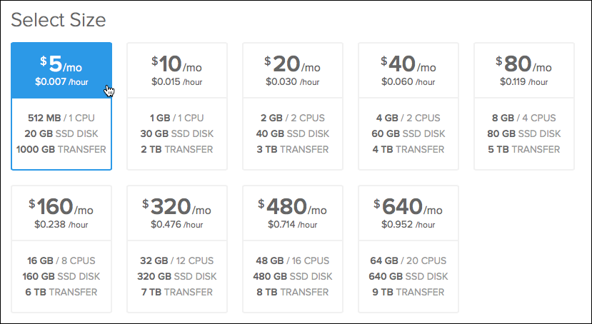
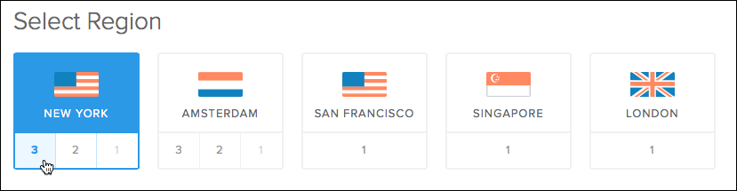
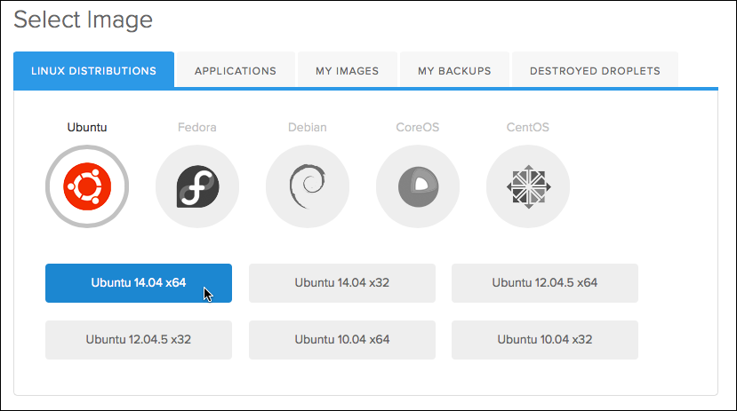

# Move to Production

All of our applications so far have been running inside of our local Vagrant boxes. Now that your blog is functional, and has user authentication, it is time to send our site out into the wild. To do this, we must first set up a new server to host it on. By default, we have decided to use a third party service called [DigitalOcean](https://www.digitalocean.com) for our hosting because of their combination of price, performance, and available support. This section will walk you through the process for creating a virtual host on DigitalOcean and deploying our blog to it using git. The overall process however, can be abstracted out to apply to most other services such as Rackspace or Linode.

## Signing up with DigitalOcean

After you finish the sign up process with [DigitalOcean](https://cloud.digitalocean.com/registrations/new) you should come to the main [control panel](https://cloud.digitalocean.com/droplets). Before we create our virtual server however, we need to copy our computer's SSH public key to DigitalOcean. An SSH key pair is a way to securely and uniquely identify you on your computer. We generated a key pair for you at the beginning of this course and have been using that key to authenticate all our pushes to GitHub. Behind the scenes, Vagrant uses it's own SSH key whenever you use the `vagrant ssh` command. Run the following in your local Mac terminal:

~~~
pbcopy < ~/.ssh/id_rsa.pub
~~~

This will copy your SSH key to your clipboard. Now navigate to the [SSH Keys](https://cloud.digitalocean.com/ssh_keys) section in the DigitalOcean dashboard. Click the `Add SSH Key` button. Give your key some meaningful name, such as "Codeup SSH Key" or "[Your Name] @ [Your Computer Name]". Paste the contents of your public key in the form and click the `Create SSH Key` button.

## Creating a Droplet

Now that our account is all set up, it's time to create our first droplet. "Droplets" are what DigitalOcean calls their virtual servers. A single droplet can host any number of sites, and even the smallest tier DigitalOcean offers should be sufficient for your personal blog (and later, your capstone). Click the big green [Create](https://cloud.digitalocean.com/droplets/new) button on the top left of your dashboard. First you must give your droplet a hostname. Hostnames can be made up of any combination of letters, numbers, periods, and dashes. Beyond that though, this is for your own internal purposes, so you can identify your droplet in DigitalOcean's dashboard. Give it a meaningful name that makes sense to you. Once you have entered a hostname, select the smallest size droplet available.

Next, select a region. Any of the regions in New York or San Francisco should be appropriate (unless, of course, you're building a site for a client in Europe or East Asia).

The optional settings below the region section are not necessary for your first droplet. After that, you will select your image. Make sure the `Linux Distribution` tab is selected, choose `Ubuntu`, and then `Ubuntu 14.04 x64`. This is the same base image your Vagrant box uses.

Next, make sure to select your new SSH key under `Add Optional SSH Keys`. With that done, click the `Create Droplet` button and wait as DigitalOcean creates our virtual server.

## Provisioning your Server

By now, DigitalOcean has created our server, but it has very little beyond the basic Linux operating system. It is essentially a blank slate and it's up to us to install our server software and applications. The act of installing and configuring the software for a new server is called "provisioning" and a popular tool for automating this process is ansible. We've been using ansible since the class began to manage our Vagrant box, but now we are going to use it to do the same thing for our DigitalOcean server.

Ansible needs to know where to find our server. The list of servers ansible manages is in a hosts file, located on your Mac at `~/vagrant-lamp/ansible/hosts`. Open this file in Sublime. On the second line you should find:

~~~
; production ansible_ssh_host=xxx.xxx.xxx.xxx
~~~

Remove the `;` from the beginning of this line (it is a comment indicator) and replace the `xxx.xxx.xxx.xxx` with your droplet's IP address. With that complete, save your changes and close the file. From your Mac command line, cd into `~/vagrant-lamp` and run the following command:

~~~
ansible-playbook ansible/prod-init.yml -l production
~~~

You should be prompted for a new user password and a notification eMail address. After that, wait as ansible performs all the basic configuration steps for your server. As part of this process, ansible will create a new user on the droplet for us called "codeup". We will be using this user in the future when connecting to the server.

After this completes, we should create a MySQL user for ourselves so that we can manage our database and check that everything is working. Thankfully, there is an ansible script written to do just this. Run the following command; you should be prompted for a username and password:

~~~
ansible-playbook ansible/mysql-user-db.yml -l production -e "mysql_admin=true"
~~~

Open up Sequel Pro and use it to confirm that your user has been created successfully. Create a connection bookmark. Just like with your Vagrant setup, make sure the `SSH` tab is selected. Use the following setting:

~~~
Name: Digital Ocean
MySQL Host: 127.0.0.1
Username: [Your New Username]
Password: [Your New Password]

SSH Host: [Your Server IP Address]
SSH User: codeup
~~~

Make sure you can connect to your database.

## Creating your Site

At this point, we've created our server, set up the server software on it, and configured a MySQL administrator for us. These steps you should only have to do once per droplet you create. If you never create another droplet, you may never have to run them again. The next steps, however, you will run for every site you create, whether it's a blog, your capstone project, or a new client website.

Your site will need a domain name. This tutorial will **not** walk you through the process of purchasing and registering a domain name. You will have to register a domain and configure your registrar to point to DigitalOcean's name servers. In the DigitalOcean dashboard, select the [DNS tab](https://cloud.digitalocean.com/domains) and click `Add Domain`. Enter in your domain name, your droplet's IP address, and select your droplet from the dropdown.

If you have not purchased a domain, or it's still propagating through the DNS system, you can create a temporary work around by editing your Mac's `/etc/hosts` file, just like we did for the domains in our Vagrant box.

The `site-create.yml` ansible script we used for creating sites in our Vagrant box is actually designed to work with both Vagrant and your DigitalOcean droplet. Still inside `~/vagrant-lamp` from your Mac, run the following:

~~~
ansible-playbook ansible/site-create.yml -l production -e "domain=[your domain name]" --ask-sudo-pass
~~~

It should ask you for a sudo password; this is the password you created for the `codeup` user when we ran the `prod-init.yml` script. As the script runs, you should see two debug messages printed about setting up a git remote; make note of these for later.

Now that ansible has created the configuration for our new site, we should do the same for MySQL. Typically your application will have a single user & database pair defined for it to use. We have created an ansible script to generate just such a pair. Run the following command:

~~~
ansible-playbook ansible/mysql-user-db.yml -l production -e "db_name=[database name]"
~~~

Like before, this script will prompt you for a new username & password. This is the user for your *application* to use.

## Deploying your Site

We have now laid all the necessary groundwork for deploying our Laravel blog to DigitalOcean. It's time to set our project up to be deployed to our server. We have been using git to manage version control for our applications and to save them to GitHub. Now, we are going to use git to actually deploy our blog to our production server. From your Mac terminal, cd into `~/vagrant-lamp/sites/blog.dev`. The git commands that `site-create.yml` echoed out will actually create a new remote called `web`. Copy and paste them into your command line to add the remote and push to it. They should look similar to the follow:

~~~
git remote add web ssh://codeup@[your server IP address]:22/var/git/[your domain name].git
git push web +master:refs/heads/master
~~~

From now on, as you work on your blog, whenever you would normally run `git push origin master` you will **also** run `git push web master`.

We also need to configure how Laravel connects to our new database. The authentication information will be stored in a file called `.env.php` located in the root of our project (`~/vagrant-lamp/sites/blog.dev`). If you have been using a `.env.local.php` file for development, creating a `.env.php` file can be as simple as running `cp .env.local.php .env.php`. Open `.env.php` in Sublime and make sure your database name, user, and password all point the new database & user we created earlier in this tutorial. You will also have to make sure your `app/config/database.php` file is updated to look for these parameters in `$_ENV`.

`.env.php` is **not** managed or tracked by git. So, running `git push web master` will **not** push it out to our site. Instead, we have to copy the file over manually. Thankfully, once the file is complete this is a one time command. From `~/vagrant-lamp/sites/blog.dev` run the following command:

~~~
scp .env.php codeup@[your server IP address]:/srv/www/[your domain name]/
~~~

This command will copy the `.env.php` file to your server. Once this is done, we need to connect to our server using SSH and do some final setup steps there. Run the following to login

~~~
ssh codeup@[your server IP address]
~~~

If you are asked for a password than something has not worked correctly. Once logged in, cd to `/srv/www/[your domain name]/`. This is the directory where your application is stored. Run `ll -A` and confirm that you see your `.env.php` file among the results. Although our code and files have been copied over, the Laravel framework and it's supporting libraries are also not tracked by git. We need to tell composer to install them for us. to do this, we run:

~~~
composer install --no-dev
~~~

We specify the `--no-dev` option so that any libraries we've included to help us in development are not installed in our production server, as they should not be necessary. Finally, we must create the database structure and initial user account for our blog. By now, we know how to do this however:

~~~
php artisan migrate --seed
~~~

Artisan should ask us to confirm if we want to continue, since this is a production server.

# Congratulations!

You did it! You have developed your first full fledged web application and deployed it to a live web server where others can visit and see your blog. Login, write some posts, delete some others, and take pride in your hard work. This is a triumphant moment for you, and all of us at Codeup are really proud of the things you've done.
