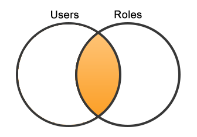
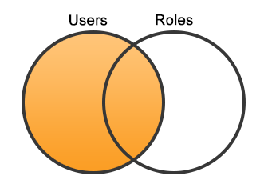
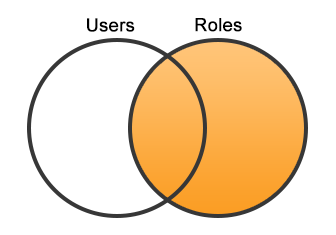

# Join

### Lesson Goals

- Understand how to join tables
- Understand the difference between a left and right join
- Understand how to join multiple tables

-------------------------------------------------

MySQL allows us to `JOIN` tables, usually based on a foreign key relationship.  The process of joining will allow us to obtain query results from more than one table in a single query. There are different types of joins, and those different types give us a lot of flexibility in the actual query results. We will be discussing the following types of joins:

- JOIN, a.k.a INNER JOIN
- LEFT JOIN
- RIGHT JOIN

## Join Syntax

The syntax for joining tables is simply using `JOIN` to describe the table that will be joining the query, and `ON` to describe the relationship.

~~~sql
SELECT columns
FROM table_a as A
JOIN table_b as B ON A.id = B.fk_id;
~~~

In the example above, the query will obtain a result based on two tables: table_a and table_b. Notice that tables can be aliased by using `table_name as alias`. The records from table_a and table_b will be joined based on the relationship provided between the column `id` in table_a and the column `fk_id` in table_b.

It is also helpful to know that the first table mentioned, `table_a` in the above example, is referred to as the *left* table of the join. The joined/second table mentioned, `table_b` in the above example, is referred to as the right table of the join.

## Join Example DB

In order to properly describe the different types of joins, we need a suitable data set. Let us assume that the following tables and associated data are put into a database named `join_test_db`.

~~~sql
CREATE TABLE roles (
  id INT UNSIGNED NOT NULL AUTO_INCREMENT,
  name VARCHAR(100) NOT NULL,
  PRIMARY KEY (id)
);

CREATE TABLE users (
  id INT UNSIGNED NOT NULL AUTO_INCREMENT,
  name VARCHAR(100) NOT NULL,
  email VARCHAR(100) NOT NULL,
  role_id INT UNSIGNED DEFAULT NULL,
  PRIMARY KEY (id),
  FOREIGN KEY (role_id) REFERENCES roles (id)
);

INSERT INTO roles (name) VALUES ('admin');
INSERT INTO roles (name) VALUES ('author');
INSERT INTO roles (name) VALUES ('reviewer');
INSERT INTO roles (name) VALUES ('commenter');

INSERT INTO users (name, email, role_id) VALUES
('bob', 'bob@example.com', 1),
('joe', 'joe@example.com', 2),
('sally', 'sally@example.com', 3),
('adam', 'adam@example.com', 3),
('jane', 'jane@example.com', null),
('mike', 'mike@example.com', null);
~~~

There are some interesting things to note, first the table structure, and then in the data set. First, observe that there is a foreign key relationship between the `role_id` in the `users` table and the `id` in the `roles` table. Next, note that the `role_id` in the `users` table allows NULL values.

Looking at the data set, we see that we have four roles in the system and six users. Two of the users, Jane and Mike, do not have a role assigned. There are also two users, Sally and Adam, that have a role in common (Reviewer). Also note that no users have a role of Commenter.

From here, we can begin looking at the different types of joins.

## Join / Inner Join

We will first discuss the basic `join`, also referred to as `inner join`. Here is an example of a `join` query on the above data set:

~~~sql
SELECT users.name as user_name, roles.name as role_name
FROM users
JOIN roles ON users.role_id = roles.id;
~~~

The example above performs a basic join (note that join can be replaced with inner join for the same result) between the `users` table and `roles` table based on the relationship between the `role_id` in the `users` table and the `id` in the `roles` table.

For a basic join, we can expect that we will get only the results where both the left and right tables have values for their respective keys that are mentioned in the `ON` part of the query. Here is a diagram explaining the expected results:

We know that there are four roles and six users in our database. However, there are only four results that have a corresponding record in both the left and right tables of the join. Here is the actual query result:

~~~
+-----------+-----------+
| user_name | role_name |
+-----------+-----------+
| bob       | admin     |
| joe       | author    |
| sally     | reviewer  |
| adam      | reviewer  |
+-----------+-----------+
4 rows in set (0.00 sec)
~~~

## Left Join

Another commonly used type of join is the `left join`. A `left join` is used when you want to retrieve all the records from the left table, regardless of whether or not they have a corresponding record in the right table. Here is an example of a `left join` query on the above data set:

~~~sql
SELECT users.name AS user_name, roles.name AS role_name
FROM users
LEFT JOIN roles ON users.role_id = roles.id;
~~~

Note that the only difference between this query and the previous query is the we have added the word `left` in front of `join` to get a `left join`. Here is a diagram explaining the expected results:

Since we know that there are six users in the database, and `users` is the left table of the query, we will get all the users returned regardless of whether or not they have a role. Here is the actual query result:

~~~
+-----------+-----------+
| user_name | role_name |
+-----------+-----------+
| bob       | admin     |
| joe       | author    |
| sally     | reviewer  |
| jane      | NULL      |
| mike      | NULL      |
| adam      | reviewer  |
+-----------+-----------+
6 rows in set (0.00 sec)
~~~

## Right Join

Another type of join is the `right join`. This one is not as common as the other types we have discussed. A `right join` is used when you want to retrieve all the records from the right table, regardless of whether or not they have a corresponding record in the left table. The reason that `right join` is not used as often is because a `right join` can be rewritten as a `left join` by changing the order of the tables in the query. Here is an example of a `right join` query on the above data set:

~~~sql
SELECT users.name AS user_name, roles.name AS role_name
FROM users
RIGHT JOIN roles ON users.role_id = roles.id;
~~~

Note that the only difference between this query and the previous query is the we have replaced the word `left` with `right` to make a `right join`. Here is a diagram explaining the expected results:

Since we know that there are four roles in the database, and `roles` is the right table of the query, we will get all the roles returned regardless of whether or not there is a user that has that role. Here is the actual query result:

~~~
+-----------+-----------+
| user_name | role_name |
+-----------+-----------+
| bob       | admin     |
| joe       | author    |
| sally     | reviewer  |
| adam      | reviewer  |
| NULL      | commenter |
+-----------+-----------+
5 rows in set (0.00 sec)
~~~

Here is the above `right join` query rewritten as a `left join`:

~~~sql
SELECT users.name as user_name, roles.name as role_name
FROM roles
LEFT JOIN users ON users.role_id = roles.id;
~~~

Notice that the only changes are that we are not using a `left` join, and the order of the tables was swapped.

## Associative Tables and Joins

Sometimes we need to use multiple joins across a table that associates two other tables with one another. In the `employees` database we have been using, multiple joins would be required to get an employee name along with the name of the department they work for.

Employees and departments are mapped through an associative table named `dept_emp`. The `dept_emp` table contains foreign keys to both the `employees` and `departments` tables. It also contains a `from_date` and `to_date` which allows for employees to be associated with different departments over time. This type of relationships is referred to as a many-to-many association. When an employee is currently active with a particular department, the `to_date` is set to `9999-01-01`. This information will be needed for our query.

Let us try to find the full name and department for the employee with an employee id of `10001`:

~~~sql
SELECT CONCAT(e.first_name, ' ', e.last_name) AS full_name, d.dept_name
FROM employees as e
JOIN dept_emp as de
  ON de.emp_no = e.emp_no
JOIN departments as d
  ON d.dept_no = de.dept_no
WHERE de.to_date = '9999-01-01' AND e.emp_no = 10001;
~~~

As you can see, we start out with the employees table. We then join the `employees` table with the `dept_emp` table on the `emp_no` relationship. Next, we join the `departments` table on the `dept_no` relationship. This bridges the gap between the employee and the department they work in. Notice that we also add the where condition with the `to_date` and the `emp_no` so we only get the active department for the employee we are looking for.

# Exercises

### Exercise Goals

- Use join, left join, and right join statements on our Join Example DB
- Integrate aggregate functions and clauses into our queries with `JOIN` statements

-------------------------------------------------

## Join Example Database

1. Create a database named `join_test_db` and run the SQL provided in the [Join Example DB section](#join-example-db) above; to create the same setup used for this lesson.

1. Insert 4 new users into the database. One should have a NULL role. The other three should be authors.

1. Use join, left join, and right join to combine results from the `users` and `roles` tables as we did in the lesson. Before you run each query, guess the expected number of results.

1. Although not explicitly covered in the lesson, aggregate functions like count can be used with join queries. Use count and the appropriate join type to get a list of roles along with the number of users that has the role. Hint: You will also need to use `group by` in the query.

## Employees Database

1. Using the example in the [Associative Table Joins section](#associative-tables-and-joins) as a guide, write a query that shows each department along with the name of the current manager for that department.

          Department Name    | Department Manager
         --------------------+--------------------
          Customer Service   | Yuchang Weedman
          Development        | Leon DasSarma
          Finance            | Isamu Legleitner
          Human Resources    | Karsten Sigstam
          Marketing          | Vishwani Minakawa
          Production         | Oscar Ghazalie
          Quality Management | Dung Pesch
          Research           | Hilary Kambil
          Sales              | Hauke Zhang

1. Find the name of all departments currently managed by women.

        Department Name | Manager Name
        ----------------+-----------------
        Development     | Leon DasSarma
        Finance         | Isamu Legleitner
        Human Resources | Karsetn Sigstam
        Research        | Hilary Kambil

1. Find the current titles of employees currently working in the Customer Service department.

        Title              | Count
        -------------------+------
        Assistant Engineer |    68
        Engineer           |   627
        Manager            |     1
        Senior Engineer    |  1790
        Senior Staff       | 11268
        Staff              |  3574
        Technique Leader   |   241

1. Find the current salary of all current managers.

        Department Name    | Name              | Salary
        -------------------+-------------------+-------
        Customer Service   | Yuchang Weedman   |  58745
        Development        | Leon DasSarma     |  74510
        Finance            | Isamu Legleitner  |  83457
        Human Resources    | Karsten Sigstam   |  65400
        Marketing          | Vishwani Minakawa | 106491
        Production         | Oscar Ghazalie    |  56654
        Quality Management | Dung Pesch        |  72876
        Research           | Hilary Kambil     |  79393
        Sales              | Hauke Zhang       | 101987

**Bonus** Find the names of all current employees, their department name, and their current manager's name.

        240,124 Rows

        Employee Name | Department Name  |  Manager Name
        --------------|------------------|-----------------
         Huan Lortz   | Customer Service | Yuchang Weedman

         .....
