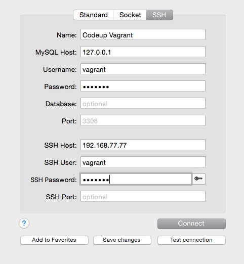
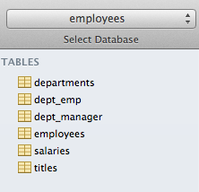

# Sequel Pro

Sequel Pro is a free and wonderful app for Mac OS X that makes working with MySQL very visual.

## Installing Sequel Pro

1. Download [Sequel Pro](http://www.sequelpro.com/) from this link: [http://www.sequelpro.com/download](http://www.sequelpro.com/download).

1. Open the .dmg file, exposing the icon for Sequel Pro.

1. Drag the Sequel Pro icon into your applications folder.

1. Open Sequel Pro by clicking on it in your launchpad or applications folder.

### Setting up Sequel Pro

We'll need to setup Sequel Pro to work with our MySQL server that is on our vagrant box.

First, be sure to click on the tab for SSH:

Next, fill in the form with the following information:

    Name: Vagrant Codeup MySQL (or something similar)
    MySQL Host: 127.0.0.1
    Username: YOUR MYSQL USERNAME
    Password: YOUR MYSQL PASSWORD

    SSH Host: 192.168.77.77
    SSH User: vagrant
    SSH Password: vagrant
    SSH Port: [leave this blank]

Click on `Add to Favorites` to save these setting.

Clicking on `Connect` should successfully connect you to your MySQL server. If it does not, ensure your vagrant box is running.  If you still cannot connect, please request the help of an instructor or lab associate.

In the top left corner is a drop-down menu to choose a database.  Using it, choose the `employees` database we installed earlier.  It should show the tables in the column on the left.

## Exercises

1. Choose the Query view from the icons at the top of Sequel Pro.

1. In the query window, craft a query that will show all the records in the `departments` table.  You should see 9 rows returned in the view below.

1. Click on the Structure tab and explore the structure of each table.
