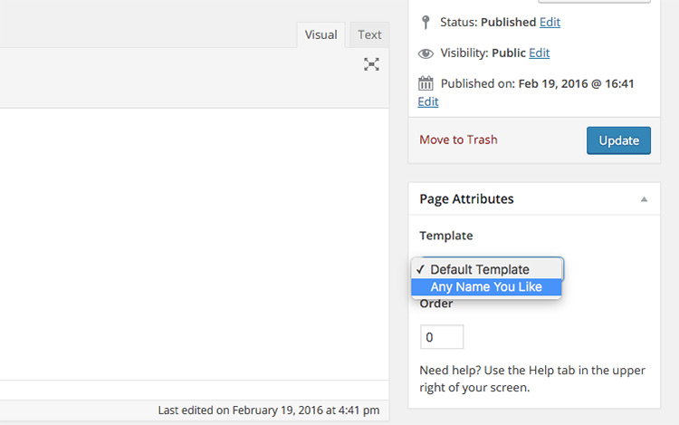

# Create a Custom Theme

Creating a custom theme for WordPress can seem overwhelming at first because the amount of files that come in their prepackage install. Truth be told you can have only the `index.php` and a `style.css` file and still have a fully functional WordPress theme. Anything beyond that is taken care of by the WordPress *template hierarchy*.

## Template Hierarchy

Internally, WordPress has several types of pages that it can serve, with each type having a matching template file that goes along with it. A template file is just a PHP file with function calls, PHP code and HTML. If that template file is not present then WordPress goes through several fall back files that it tries to reach and send. If WordPress can not find any of the template fall backs in its hierarchy then it makes its way back to the `index.php` file. Please take the time to read through [WordPress Template Hierarchy](https://developer.wordpress.org/themes/basics/template-hierarchy). This will explain the order of precedence WordPress uses to load the template files. It also has a diagram explaining how and what files WordPress looks for and in what order. For a more interactive template hierarchy see [Template Hierarchy Resource](http://wphierarchy.com). This resource has also links back to the actual WordPress manual for each template type.

## Page Types

The WordPress codex should be your goto resource for comprehensive information on the WordPress hierarchy. Below, we will break down some of the more common and useful page types in better detail.

### index.php

This is the main fallback file if a regular template file is not available for the current page. As WordPress goes through the hierarchy of templates for the current page, if no templates can be found then the `index.php` gets used as the template. The `index.php` file is also the template for blog posts, unless `home.php` exists on the server.

### front-page.php

This is the front facing page for your site. If you do not have this file in your directory then WordPress will fall back to `page.php` or `home.php`, depending on whether WordPress is set to display blog posts on the front page. If those files cannot be found, then WordPress falls back on `index.php`

### home.php

This is the home page for blog posts. This is different than the actual homepage for your site, (aka `front-page.php`). Remember that WordPress started as a blog software and moved its way into content management. So even if WordPress is configured to display a blog outside the root of your site, `home.php` is used as the index of your blog posts.

### page.php

This is the default template for all content under the Pages tab in the dashboard. Pages can be used for any content outside of a blog, such as an "About Me" page, or a "Contact Us". After `page.php`, the fallback is just `index.php`.

### single.php

The `single.php` fils is used for displaying a single blog post. Typically you would get to this page by click on a post's title on the blog index. Just like `page.php`, the fallback for `single.php` is `index.php`.

### 404.php

This template is used for missing pages that should send a `404`. The fallback for this file is `index.php`.

## Custom Template files

You can also create your own custom template that will be available in the admin area for selection. It will be available in a pulldown on the pages section like the image below:



All you need to do is create a `php` file anywhere in your theme directory with the content below. Normally users create a template folder or something similar inside the theme folder and place all the custom themes in there. `themes/{selected_theme}/templates/`. This will override the template hierarchy of Wordpress.

```
<?php

/*
Template name: Any Name You Like
*/
... // your code
```

## Other Template Files

Below are more template files and how they load. They are listed in order of precedence.

- Show categories: `category-{slug}.php`, `category-{id}.php`, `category.php`, `archive.php`, `index.php`
- Show tags page: `tag-{slug}.php`, `tag-{id}.php`, `tag.php`, `archive.php`, `index.php`
- Custom taxonomy page: `taxonomy-{taxonomy}-{term}.php`, `taxonomy-{taxonomy}.php`, `taxonomy.php`, `archive.php`, `index.php`
- Custom Post Types: `archive-{post-type}.php`, `archive.php`, `index.php`
- Search page results: `search.php`, `index.php`

_Note_: Taxonomies are a way for WordPress to group posts, pages, and other data together. Wordpress has two default taxonomies already built in called *categories* and *tags*.

## Partial Files

We have partial files that help when building WordPress themes as well. Normally, like in our lesson on `require` and `include` you would break a theme apart by the header area and footer areas and `include` to those files. WordPress does something similar, but it gives us functions to do some of this automatically. The partials are listed below, along with the function calls that will include them automatically.

- `header.php` &mdash; `get_header()`
- `footer.php` &mdash; `get_footer()`
- `sidebar.php` &mdash; `get_sidebar()`
- `searchform.php` &mdash; `get_search_form()`
- `comments.php` &mdash; `comments_template()`

You can also create a different header if you should need to by creating a file named `header-{name}.php`. To include that file, you would pass the name of the header to `get_header()`. For example, if you created `header-home.php`, to include it you would call `get_header('home')`. The same goes for `footer` and `sidebar` partials as well.

If you need more flexibility with your partial files, you can use `get_template_part()`. This function allows you to include files from anywhere in your theme as long as they follow a particular naming convention. `get_template_part()` expects a *slug* as well as a template *name* as parameters; the slug and name get put together with a dash between them. Calling `get_template_part('content', 'page')` would include `content-page.php`. The slug can also contain a directory so we can consolidate our template files into a separate directory. If we were to use `get_template_part('partials/content', 'page')`, WordPress would try to include `partials/content-page.php`. This can be a good way to organize your theme directory.

## functions.php

The functions file is where you would put any and all additional functions you need to use for your theme. The `functions.php` file is also the preferred location to register any extra CSS and JavaScript files your theme uses. `wp_head()` will then include the tags for those file.

## Creating Your Theme

Create a new folder in the themes directory called `themelesson`. Download the following and unzip to your new directory [WordPress Base Theme](../examples/wordpress/codeuptheme.zip).

To start your theme open the `style.css` file. WordPress Themes work off the comments that are at the top of `style.css`. Modify this area to your liking. Also notice you can replace the `screenshot.png` with a screenshot of your theme for showing in the admin area. Here are the CSS comments that should be changed:

```css
/*
Theme Name: (Your theme name here)
Theme URI: (Your theme url)
Author: (Your name)
Author URI: (Your page url)
Description: (Your description)
Version: 1.0
License: GNU General Public License v2 or later
License URI: http://www.gnu.org/licenses/gpl-2.0.html
Tags: tags, if, for, searching, on, WordPress, if, you, launch, it
Text Domain: (unique name for your theme, for separation. also used for transalation file)

This theme, like WordPress, is licensed under the GPL.
Use it to make something cool, have fun, and share what you've learned with others.
*/
```

Also take note that the `header.php` file has an opening `div` tag that gets closed in the `footer.php` file.

All you have left is to start editing the css file and html inside each of these templates. If you should need a home page that looks differently than rest of the pages then simply copy the index.php contents to a new file called `front-page.php` and now the home page will load off of the `front-page.php` file.

## Exercise

1. Create your custom WordPress theme using the files provided as a starting point.
1. Add a `front-page.php` file and alter it. See how it changes the way your home page works. Feel free to keep it if your theme requires it. Delete it if you do not need it.
1. Continue to build out the theme to your liking till you have a full working WordPress theme.

Reference WordPress documentation on theming to help you through the process. [Theme Development](https://codex.wordpress.org/Theme_Development)
