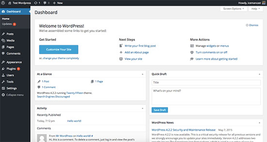

# Dashboard Screen

Becoming familiar with the WordPress dashboard is a must for any WordPress development you will be doing. Be sure to login to your `myblog.dev` domain as we go over the following dashboard areas below. To get to any admin area inside of WordPress you would simply append `/wp-admin` to the domain. So in your case go to [http://myblog.dev/wp-admin](http://myblog.dev/wp-admin)

## Posts

This section is where you create blog posts for WordPress. You can see a title area, content area, and items on the right that allow you schedule a post, categorize it, and/or add tags. This post page also has other options that are not visible on load. To the top right you will see `Screen Options` which gives you more settings for your posts section.

## Media

This is the section where you can upload images for your posts or pages. Normally we do not interact with this section much as the `Posts` and `Pages` give us areas to upload images that interact with this media section automatically.

## Pages

This is where we create pages for our website. A page is anything *other* than a blog post, like `About`, `Contact`, `Location` etc. It has the same format for creation that the posts section does.

## Comments

This is the area where all comments for our posts are stored. Each post we make does gives us an option to turn comments off. If you do not see this option after the post it is available in the `Screen Options` area.

## Appearance

This is where we install themes for our blog/site. We can also interact with widgets and menu items in this area.

## Plugins

The plugins area is where you interact, install, and update plugins. If you ever see red notifications like in our screenshot above it is because that plugin is outdated and needs to be updated.

## Users

This is where we add other users to use our WordPress website and give them different permissions. We can let the system know whether they are administrators, editors, authors, or plain users. For more detail on what those user types all mean, you can read a [Summary of Roles](https://codex.wordpress.org/Roles_and_Capabilities).

## Tools

This area is for importing or exporting WordPress data. If you would need to migrate your site over to another server you could export all the data, install a new version WordPress on the new server and then import that data on that new install.

## Settings

Settings area for our WordPress blog/site. Some things to note here are the name and home URL for our blog under the `General` area. Under the `Reading` area we have an option for how to control our front facing page in WordPress. By default WordPress loads blog posts as the home page. We can alter that behavior under the `Reading` section by selecting `A Static Page` option under `Front Page Displays`.

Also we can create a format for our permalinks. A permalink is what shows up in the URL for a particular page or post.

## Exercise

1. Login into your dashboard for `myblog.dev` and click each dashboard item to familiarize yourself with it.
1. Delete the `sample page` post from `myblog.dev`.
1. Create a new page called `My Blog`.
1. Remember by default a WordPress install makes the blog section your home page. Find the area where you can make `My Blog` page your home page for the site.
1. Add a link to the navigation menu that points to [Codeup](http://codeup.com). After saving check to see if your link worked.
