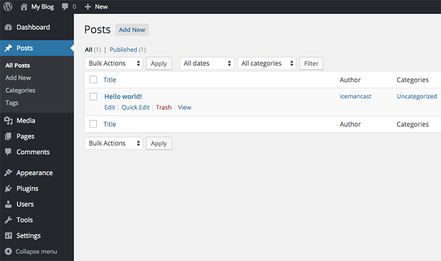
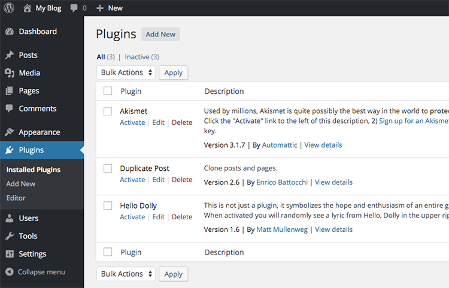
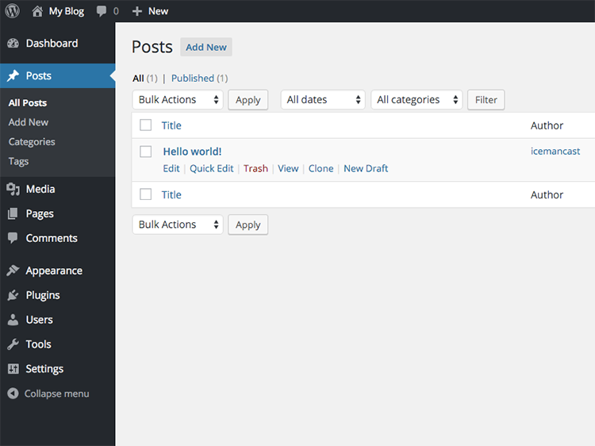
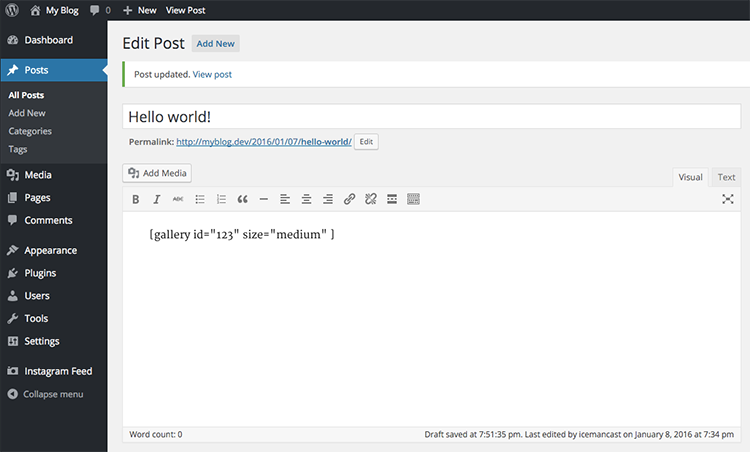

# Installing Plugins

Plugins are what give WordPress capabilities past its normal install. With a WordPress install you can create pages and posts right out of the box. But what if you wanted something to alter how the content was rendered, like adding social icons so people can share these posts? What if you needed a photo gallery? What if you wanted a sidebar area that just displayed useless information like the [Did you know?](https://wordpress.org/plugins/mm-did-you-know) plugin?

WordPress has 42,000+ plugins registered on [their website](https://wordpress.org/plugins) that do just about anything you can think of.

## The Goods

Because of WordPress' popularity there are plugins for just about anything you might need. Not only that, but often there are multiple plugins for that one particular item you are looking for. Most plugins are free, although some are more premium and you would have to pay for those. If one photo gallery plugin does not work for your needs then you can use any of the other 1,000+ photo gallery plugins that WordPress has in [their directory](https://wordpress.org/plugins/search.php?q=gallery).

## The Bads

Because a majority of the plugins are open sourced anyone and everyone can create a plugin. That being said, not every plugin adheres to best practices. So some plugins are great, have clear documentation, and work right out of the box. Some plugins are not so good and require a lot of hard work to figure out how to control their settings. Plus, documentation for these bad plugins is usually lacking. Take a look at the [Did you know?](https://wordpress.org/plugins/mm-did-you-know) plugin and see that it has a 5 star rating! It does, but only one person reviewed it (Shhh... it was probably the author). When looking for a plugin be sure to pay attention to the ratings before you download and use it. Pay attention to the year the plugin was last updated as well, to gauge if it is still being maintained. Also remember before spending a lot of time on a plugin's settings that there may be another (easier) plugin to use.

## Lets Install Our First Plugin

We will be downloading a plugin called [Duplicate Post](https://wordpress.org/plugins/duplicate-post). This plugin allows you to create a duplicate of an already existing blog post. This would come in handy if all your posts had a particular format to follow. Instead of creating a new one over and over again you could just duplicate the post and edit it the way you would need to. As you can see, this one has 5 stars from 179 users. It has also been downloaded 900,000+ times.

1. Click on the download button.
1. Go to your `Downloads` folder and unzip the contents of the file.
1. Move this entire folder to `~/vagrant-lamp/sites/myblog.dev/wp-contents/plugins/`. You can do so with the following command: `mv ~/Downloads/duplicate-post ~/vagrant-lamp/sites/myblog.dev/public/wp-content/plugins/duplicate-post`
1. Now login to your WordPress admin area [http://myblog.dev/wp-admin](http://myblog.dev/wp-admin).

Before activating the plugin notice the posts page. Make a note of what the posts area looks like before we install the plugin. Notice how our additional actions are `Edit`, `Quick Edit`, `Trash`, and `View`.

Now go to the plugin area. Our plugin is on the dashboard and ready to be activated. Activate the `Duplicate Post` plugin by clicking the activate link for the plugin.

Now go back to the posts page and you will see when you hover over the title of the blog that it gives you some additional features. We can now `Clone` a post if we need to.

Not all plugins interact with posts. Some plugins create a new section for events, or help with posting to social media. Some add additional settings, like backing up your WordPress blog on the server. The possibilities with WordPress plugins are virtually endless. When you come to a point where you cannot find one that suites your needs (believe me its hard to do that), then you can just [create your own plugin](https://codex.wordpress.org/Writing_a_Plugin).

## Shortcodes

Sometimes plugins need a way to insert the results of their content inside a blog post or a page. These plugins do so by providing what is called a shortcode. Shortcodes may look like `[gallery id="123" size="medium"]`. All shortcodes will be a little different and some may very well be written as just `[gallery]` (this is an actual shortcode that is built into the WordPress core). It is up to the author of the plugin what shortcodes to make and if they require additional attributes like `id` or `size`. Also note that not every plugin will have shortcodes. When a plugin uses shortcodes you will place them in the content area of either posts or pages. WordPress will convert the shortcode to the raw code that needs to replace it.

## Exercise

Let's say a client or boss approached us needing a job board on their website. We found one that will work for our needs. The title of the plugin is [WP Job Manager](https://wordpress.org/plugins/wp-job-manager). Note when this plugin installs it creates pages for you that will correspond to the different areas of this plugin. Just keep in mind that each plugin interacts differently with the WordPress dashboard. Some do not even interact with the dashboard at all and are more of a filter for you content.

1. Download and install `WP Job Manager`.
1. Add the following job types: `freelance`, `full time`, `internship`, `part time`, and `temporary`.
1. Find and modify the listing duration to 90 days.
1. Create a job posting for each job type. Be creative!
