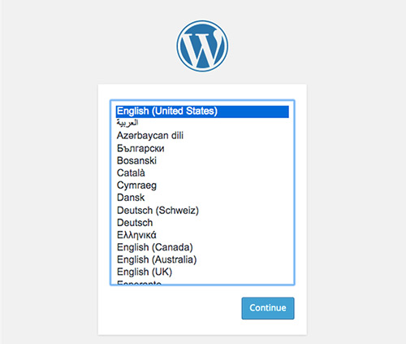
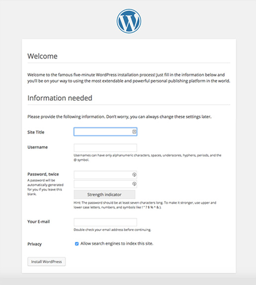
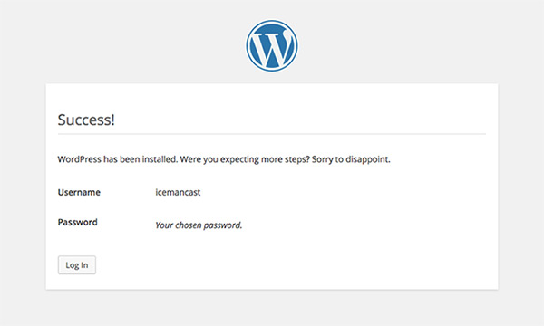
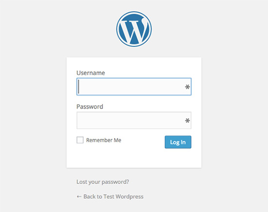

# Installing WordPress

We will be setting up a new local domain for our first WordPress install.

## Setup a Local Site

From within the `~/vagrant-lamp` directory on your Mac, run the following command:

```bash
ansible-playbook ansible/playbooks/vagrant/mysql/app/wordpress.yml
```

Specify a domain name. You will also be prompted for database properties:

    MySQL Database Name (e.g. something_db): wordpress_db
    MySQL User for Database (e.g. something_user): wordpress_user
    MySQL User Password: (your password)
    confirm MySQL User Password: (your password)

Edit your host file with: `subl /etc/hosts`. Add an additional line:

    192.168.77.77 [domain name]

## Download the Files for WordPress

Go to [WordPress Download Page](https://wordpress.org/download/). Download the zip file to your computer and once complete unzip the contents of the zip file by double clicking it. Move all the contents inside this WordPress folder to your `~/vagrant-lamp/sites/[domain name]/public/` folder.

## Edit Config File

First lets help secure our config file by moving it out of the public directory. We are going to use the `wp-config-sample.php` file WordPress provided as a starting point. Run the following commands one at a time:

```bash
cd ~/vagrant-lamp/sites/wordpresslesson.dev
mv public/wp-config-sample.php wp-config.php
subl wp-config.php

```

Next, add your database credentials by editing the following lines:

```php
/** The name of the database for WordPress */
define('DB_NAME', 'wordpress_db');

/** MySQL database username */
define('DB_USER', 'wordpress_user');

/** MySQL database password */
define('DB_PASSWORD', '[your password]');
```

### Unique Security Keys

WordPress handles history from page to page with cookies. This became a security flaw, so in recent versions of WordPress cookie information is encrypted. To ensure the encryption is kept secure, you will need to update the keys in `wp-config.php`. Keep these keys safe and __do not__ push this config file to GitHub. Make sure to add `wp-config.php` to your `.gitignore` file.

WordPress has [a page](https://api.wordpress.org/secret-key/1.1/salt/) to help generate these keys automatically.

Copy content of that page. Paste it into `wp-config.php` replacing the following&hellip;

```php
define('AUTH_KEY',         'put your unique phrase here');
define('SECURE_AUTH_KEY',  'put your unique phrase here');
define('LOGGED_IN_KEY',    'put your unique phrase here');
define('NONCE_KEY',        'put your unique phrase here');
define('AUTH_SALT',        'put your unique phrase here');
define('SECURE_AUTH_SALT', 'put your unique phrase here');
define('LOGGED_IN_SALT',   'put your unique phrase here');
define('NONCE_SALT',       'put your unique phrase here');
```

&hellip;with something like this:

```php
define('AUTH_KEY',         'FvHb^yZNG11^8B$+r|T<FVOZ>V.CoycT5[<|{|?lHGjg!L*-$W;lUDr,GnTGC]7q');
define('SECURE_AUTH_KEY',  '>&NL yGJsCAEJjbL+(+KY%}n6XKqH$[8,xt=J0%X(:CQ>XI- _pI!-ir#9EY:%:4');
define('LOGGED_IN_KEY',    'B7!$rFhWEpK{$I5 zW4O5@%|VX1*q!bn1G4@(`*y|qF%pPJ<U`HW$Y$N(B2&cf$R');
define('NONCE_KEY',        'aYIP$-;tx&E~JY$iC;e%peH,8my&n=UpXGJm*2V8{WNU<yp-uU@Xf4uh1+>^jLc]');
define('AUTH_SALT',        'U;.3,+Hl@NWQ;hc8OUHvTiqV+D;35uz#JS-BG]G_.l?P*p6H}g_Tj!p1IRVMk!f ');
define('SECURE_AUTH_SALT', '36n7O5WJKj<SPq4`vQf,Hv]j-E_dd{%ZlUgs>=%nE4E,NEfFKTW=r(?{A~CbE:0+');
define('LOGGED_IN_SALT',   '3bHgrT/;^`7}Z,wG. ;Vs.S;lizYLi2vh]Z|Ey4C9PpE$saKnRA0[Vpq#Ug0#cj)');
define('NONCE_SALT',       '0Xrb]0xDl`~V-$lTyhJ0t$6J}pO2G{[4w]y!TEe^ 44i-kCcB[VqN*3+IVNk=jiA');
```

Remember, your specific key values will be different!

## Install

The final parts of installing WordPress are done through the web interface. Go to your site's domain name in Chrome and follow the interface steps laid about below.

### Language Selection Screen

You should see the screen below where you will select your language and press continue.



### Site & User Information

Next, you will need to fill out some information about the WordPress site and your user account.



### Success Screen

If all goes well, you will see the success screen!



### Login Screen

Clicking the button on that page should now take you to the WordPress login form.



## Exercise

Follow the steps outlined above to create your WordPress site under `myblog.dev`.

1. Create the site and database with Ansible and edit your `/etc/hosts` file.
1. Download the WordPress software (if necessary).
1. Create your `wp-config.php` file and make sure the encryption keys are set appropriately.
1. Start a git repo for this new site, make sure `wp-config.php` is not tracked in git.
1. Visit http://myblog.dev to finish the installation process.
1. Be sure to commit your changes to git and push to GitHub.
1. After you have installed your site, take some time to glance over and bookmark the [WordPress Documentation](https://codex.wordpress.org)

